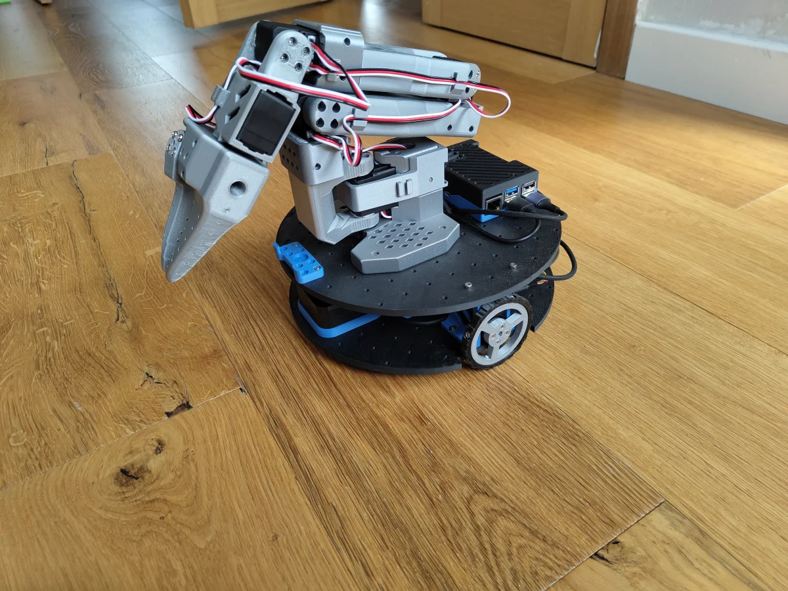

# Mote


A differential drive robot platform combining the accessibility of
[LeKiwi](https://github.com/TheRobotStudio/SO-ARM100) with standard ROS2/Nav2
infrastructure and [ORP](https://openroboticplatform.com/) interoperability.
Intended as a comparison platform between classical ROS/Nav2 navigation and
learned policies via [LeRobot](https://github.com/huggingface/lerobot).

See [`design/`](design/) for hardware design decisions, requirements, and bill
of materials.

## Hardware

- Raspberry Pi 5 (4GB)
- 2× Feetech STS3215 servo
- Waveshare Serial Bus Servo Driver Board
- SLAMTEC RPLIDAR C1
- USB webcam
- 5V USB-C power bank (slim form factor, ≥85W dual output)

## SO-101 Follower Arm



The chassis is compatible with the [SO-101 follower arm](https://github.com/TheRobotStudio/SO-ARM100) via the ORP mounting grid. See the SO-ARM100 project for the arm's BOM and assembly instructions.

## Software

Built with ROS2 Jazzy, managed via [pixi](https://pixi.sh).

| Package | Purpose |
|---|---|
| [`mote_bringup`](mote_bringup/) | Launch files for bringing up the robot |
| [`mote_description`](mote_description/) | URDF robot model and TF tree |
| [`mote_hardware`](mote_hardware/) | ros2_control hardware interface for the Feetech servo bus (SDK: **`scservo-linux`** from [`mote`](https://prefix.dev/mote) via Pixi) |

## Getting Started

Clone the repo with submodules:

```bash
git clone --recurse-submodules https://github.com/ClachDev/Mote
```

Install [pixi](https://pixi.prefix.dev/) if you don't have it, then build:

```bash
pixi run build
```

Launch:

```bash
pixi run launch
```
