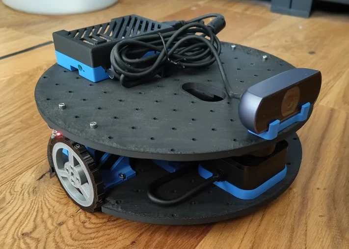
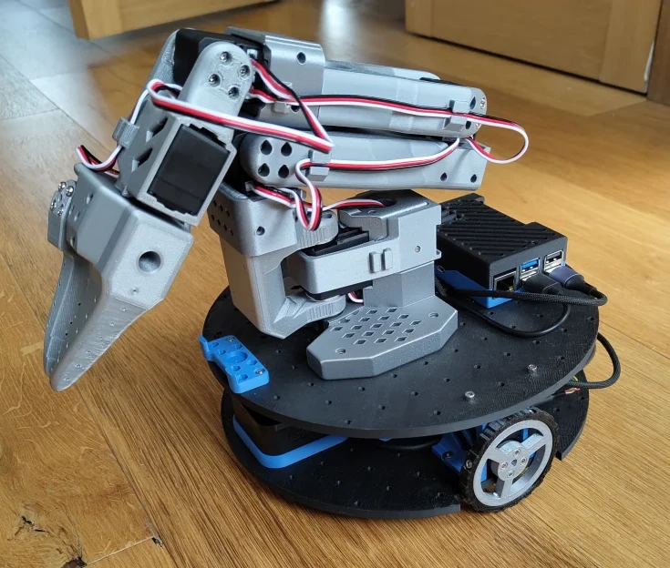

# Mote

[](https://github.com/ClachDev/Mote/actions/workflows/build.yml)



## *Mote*vation (I'm sorry I had to!)

While working on some libraries I really needed a simple robot platform to test
them out on. There are some existing platforms but they are either too expensive
(turtlebot 3), or much too expensive (turtlebot 4). Some are cheap but lack
sensors (LeKiwi).

When I started out in robotics there was a [$50
robot](https://www.societyofrobots.com/step_by_step_robot.shtml) project I
followed. That was made for a different age but I figured why not see how
cheaply I can make a fully functioning robotics platform for today's enthusiasts.

The main factors I've engineered for are:

1. it must be as **cheap** as operationally possible - if it isn't affordable the
   project loses purpose.
2. it must be able to run **ROS** - you should be able to use this platform to run a
   normal ROS stack to map and navigate around a home or office.
3. it must be compatible with cutting edge PhysicalAI platforms like **LeRobot** -
   ROS is good but the future requires experimentation
4. it should follow the [Open Robotic
   Platform](https://openroboticplatform.com/designrules) standard - robots are
   more fun if you tinker about and add arms.

I've taken a lot of inspiration from projects like
[LeKiwi](https://github.com/SIGRobotics-UIUC/LeKiwi) which aim to be accessible
and [ORP](https://openroboticplatform.com/) which wants interoperability. Apart
from allowing me to test algorithms, I also want Mote to be a comparison
platform between classical ROS/Nav2 navigation and learned policies via
[LeRobot](https://github.com/huggingface/lerobot).

See [`design/`](design/) for hardware design decisions, requirements, and bill
of materials.

## Hardware

The main hardware components are below with the Raspberry Pi and the battery
being the biggest cost factors (see [the BOM](design/BOM.md) for the full
hardware list).

- Raspberry Pi 5 (4GB) - Linux so we can run ROS, 4GB because memory is crazy expensive these days
- 5V USB-C power bank (slim form factor, ≥85W dual output) - Easy, cheap, and simple to integrate power supply
- 2× Feetech STS3215 servo - this simplifies our logic and standardises on components used by the [SO-101 arm](https://github.com/TheRobotStudio/SO-ARM100)
- Waveshare Serial Bus Servo Driver Board - Needed to connect servos to the pi.
  If using the SO-101 arm you can share a single board.
- SLAMTEC RPLIDAR C1 - The cheapest LIDAR I could find.
- USB webcam - Need some vision for LeRobot to function. Also helps with teleoperation.

I've tried to keep as many of the components 3D printed as possible to keep it
accessible. In theory some parts of the chassis can be CNC'd but I don't have
the ability to test and iterate on that right now.

## Software

Built with ROS2 Jazzy, managed via [pixi](https://pixi.sh). This gives us a nice
way to package everything up without worrying about ecosystem concerns.

| Package                                 | Purpose                                                   |
| --------------------------------------- | --------------------------------------------------------- |
| [`mote_bringup`](mote_bringup/)         | Launch files for bringing up the robot                    |
| [`mote_description`](mote_description/) | URDF robot model and TF tree                              |
| [`mote_hardware`](mote_hardware/)       | ros2_control hardware interface for the Feetech servo bus |
| [`mote_nav`](mote_nav/)                 | Nav2 plugins for navigation                               |
| [`mote_perception`](mote_perception/)   | Camera-derived perception (health monitor, depth obstacles) |
| [`mote_tasks`](mote_tasks/)             | Behaviour-tree task layer that drives Nav2 to run missions |
| [`mote_simulation`](mote_simulation/)   | Gazebo sim, worlds, and smoke test (workstation only)     |

I'm trying to keep all dependencies from
[Robostack](https://robostack.github.io/index.html) or `conda-forge`. Anything
else belongs as a git submodule moving to either `conda-forge` or the
`prefix.dev/mote` channel once condafied/pixified.

## Build & Setup

### Prerequisites

- A Raspberry Pi 5 running 64-bit Linux (Ubuntu 24.04 or Raspberry Pi OS
  Bookworm both work) - set up with [Raspberry Pi
  Imager](https://www.raspberrypi.com/software/) -> Raspberry Pi OS Other ->
  Raspberry Pi OS Lite.
- [pixi](https://pixi.prefix.dev/) installed. Everything else (ROS 2 Jazzy,
  Nav2, drivers) is pulled in by pixi, so you don't need a system ROS install.
- The robot assembled with the servos and sensors wired to the Pi.

**Note:** The build commands (1 and 2) can be run on your developer machine for
testing, but 3 onwards requires the real hardware connected so must be run on
the Pi.

### 1. Clone

```bash
git clone --recurse-submodules https://github.com/ClachDev/Mote
cd Mote
```

If you forgot `--recurse-submodules`, fetch the submodules afterwards:

```bash
pixi run submodules
```

### 2. Build

```bash
pixi run build
```

If you run these on your developer machine, you can sync the code to the Pi using

```bash
pixi run sync          # one-off sync
# or
pixi run sync-watch    # sync changes automatically
```

### 3. Setup Pi

There are a few setup tasks that must be run on the Pi before first use. These
set up udev rules, systemd services, and other configuration. It should only
need to be run once.

```bash
pixi run setup
```

### 4. Configure the servos

The drive wheels are expected at servo IDs **7** (left) and **9** (right) at
1 Mbaud. Fresh Feetech STS3215 servos ship as ID 1, so you'll need to assign
IDs before first use. Run the guided setup and connect one servo at a time when
prompted:

```bash
pixi run setup-ids
```

The IDs, baud rate and `velocity_scale` (the rad/s → raw servo-unit conversion)
live in [`mote_description/config/robot.yaml`](mote_description/config/robot.yaml),
which is the single source of truth for all robot configuration. Both the URDF
and the launch file read from it.

The other helper tools in [`mote_hardware/tools/`](mote_hardware/tools/) round
this out: `servo_debug` to inspect and drive individual servos, `velocity_cal`
to measure `velocity_scale` on your hardware, and `swap_ids` to flip the
left/right IDs if the wheels turn the wrong way. See
[`mote_hardware/tools/README.md`](mote_hardware/tools/README.md).

### 5. Launch

```bash
pixi run launch # Launches the base (hardware, lidar, camera, odometry)
pixi run rviz   # Runs rviz to view the map and navigate
# and
pixi run slam   # Runs the SLAM stack to create a map
# or
pixi run nav    # Runs the nav stack

# Convenience combos (base + the relevant stack in one command):
pixi run mapping # = launch + slam  (build/extend a map)
pixi run robot   # = launch + nav   (drive a saved map at ~/.mote/map.yaml)
```

### Fleet: remote operation (optional)

A robot works standalone with nothing above, but it can also join a fleet
overlay so it is reachable and identifiable from anywhere:

```bash
pixi run identity set --id mote-01 --name "Scout"   # this robot's fleet id
pixi run tailnet --role robot --auth-key tskey-auth-...  # join the Tailscale mesh
```

The robot is then reachable off-LAN at `mote-01` by MagicDNS, with no port
forwarding and nothing exposed to the internet. A *new* Pi can be provisioned
into that state unattended from a rendered cloud-init file
(`pixi run provision`).

See [`docs/fleet/README.md`](docs/fleet/README.md) for the runbook and
[`docs/design/fleet.md`](docs/design/fleet.md) for where this is going.

### Simulation (no hardware required)

A Gazebo (gz-sim) simulation of Mote runs entirely on a workstation — same
controllers, same scan pipeline, so the SLAM and Nav2 stacks work against it
unmodified. The sim dependencies live in a separate pixi environment so the
robot install stays lean:

```bash
pixi run sim                                                     # headless gz + robot + controllers
pixi run sim-test                                                # ~20 s headless smoke test (drive + odom + scan + map)
pixi run teleop                                                  # drive it around
# Ad-hoc commands need the sim environment named explicitly:
pixi run -e sim -- ros2 launch mote_bringup slam_launch.py use_sim_time:=true
pixi run -e sim -- gz sim -g                                     # optional: attach the Gazebo GUI
```

`sim-test` is a fast end-to-end check: it brings up the sim and SLAM, drives the
robot, and asserts odometry integrates the motion, the lidar publishes sane
scans, and slam_toolbox produces a map. It needs a working render backend
(a GPU or fast software GL), so it's a local pre-PR gate rather than a
hosted-CI job — see the comment in
[`run_sim_smoke.sh`](mote_simulation/test/sim_smoke/run_sim_smoke.sh).

The worlds in `mote_simulation/worlds/` form an easy-to-hard ladder, selectable
with `world:=` (e.g. `pixi run sim world:=hospital_world.sdf`):

- **`mote_world.sdf`** (easy) — a simple walled room with a few obstacles; the
  default and the `sim-test` world.
- **`office_world.sdf`** (medium) — a long hospital-ward corridor of identical
  rooms that stresses localisation (aperture-problem drift, false loop closures).
- **`hospital_world.sdf`** (hard) — a ~58×38 m hospital with a looping corridor
  grid, ~50 rooms, and furniture clutter; it stacks those failure modes and adds
  genuine navigable loops. Generated by
  [`gen_hospital.py`](mote_simulation/worlds/gen_hospital.py) — edit the layout
  there and regenerate rather than hand-editing the SDF.

The simulated lidar uses RPLIDAR C1 datasheet values from
[`robot.yaml`](mote_description/config/robot.yaml).

### Deploying to the Pi

The above section assumes you are developing entirely on the Pi, which is
definitely feasible at this stage. Developing on a laptop and running on the Pi
takes one of two paths, depending on whether you are iterating or shipping.

**Iterating — rsync.** The `sync` task targets an SSH host named `mote` — change
the host in the [`pixi.toml`](pixi.toml) `[tasks]` `sync` entry to match your
Pi, then:

```bash
pixi run sync             # one-shot push
pixi run sync-watch       # keep pushing on every save (needs the dev env)
```

Because the build uses `colcon --symlink-install`, edits to launch files,
`robot.yaml` and Python go live with no rebuild; only C++ needs `pixi run build`.

**Shipping — versioned packages.** The first-party packages are published to the
`prefix.dev/mote` channel (built with
[`pixi-build-ros`](https://pixi.prefix.dev/latest/build/ros/)), so a robot runs
an environment resolved from that channel — no source checkout and no compile on
the bot. Updates are by version, and reversible:

```bash
mote-update stage 0.2.0     # download and install; the robot keeps running
mote-update cutover 0.2.0   # stop, flip, restart, health-gate
mote-update rollback        # back to the previous version
```

`~/.mote` — identity, maps, calibration — lives outside the deploy and survives
every update. See [`docs/releasing.md`](docs/releasing.md) for the version
scheme, how a release is cut, and the full robot update procedure.

## SO-101 Follower Arm



The chassis is compatible with the [SO-101 follower
arm](https://github.com/TheRobotStudio/SO-ARM100) via the ORP mounting grid and
a custom base. See the SO-ARM100 project for the arm's BOM and assembly
instructions.

My long term goal is to eventually have Mote able to explore a space and tidy
things up off the floor [obligatory xkcd](https://xkcd.com/1425/).

## Contributions

This project is still in its early stages and I'm happy to accept contributions
of any kind. AI _aided_ contributions are also welcome but only if you can explain
and vouch for every change!

A [pre-commit](https://pre-commit.com/) config handles quick hygiene checks,
shell linting (shellcheck) and Python error checking (ruff). Enable it once per
clone, and it runs automatically on commit:

```bash
pixi run lint-install   # wire it into .git/hooks (one time)
pixi run lint           # or run across the whole tree manually (~1 s)
```

## Sponsorship

If you want to help me test new sensors or components to lower the cost even
further please consider sponsoring the project and I'll recognise you or your
company here!
