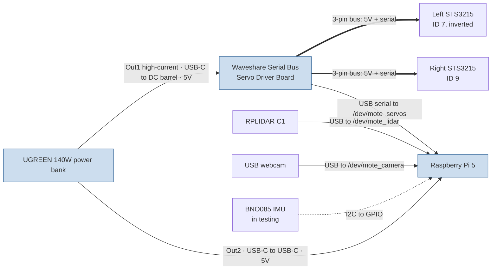

# Wiring & Power

How the Mote electronics connect. Everything runs from a single USB-C power
bank at **5 V** (see [the 5 V-only rationale](README.md#power-5v-only)). Device
names in the launch stack (`/dev/mote_*`) are created by the udev rules in
[`mote_bringup/udev/`](../mote_bringup/udev/).

Every data link is plain USB (standard male plugs into the device ports), so
there's no special connector wiring — just the cables in the [BOM](BOM.md).
A few electrical details still want bench confirmation; those are marked **Verify**.

## Diagram

Solid lines = power and/or wired data. The lidar, camera and IMU are powered by
the Pi over their data connection (USB / GPIO), not from the bank directly.

## Connections

### Power

| From (port)                 | Cable                                 | To                       | Carries |
| --------------------------- | ------------------------------------- | ------------------------ | ------- |
| Bank **Out1** (100 W USB-C) | USB-C → DC 5.5×2.1 mm barrel, **5 V** | Servo board DC input     | 5 V     |
| Bank **Out2** (45 W USB-C)  | USB-C ↔ USB-C, 0.3 m                  | Pi 5 USB-C power in      | 5 V     |
| Servo board                 | 3-pin servo lead                      | Left STS3215 (**ID 7**)  | 5 V     |
| Servo board                 | 3-pin servo lead                      | Right STS3215 (**ID 9**) | 5 V     |

### Data

| From                     | Cable                          | To       | Device node        | Notes                         |
| ------------------------ | ------------------------------ | -------- | ------------------ | ----------------------------- |
| Servo board (USB-C data) | USB-A ↔ USB-C, 0.3 m           | Pi USB-A | `/dev/mote_servos` | CH343 USB-serial, 1 Mbaud     |
| RPLIDAR C1               | USB (cable supplied with unit) | Pi USB-A | `/dev/mote_lidar`  | 460800 baud; powered over USB |
| USB webcam               | USB-A (captive)                | Pi USB-A | `/dev/mote_camera` | UVC; powered over USB         |

The Pi 5 has 4 USB ports (2× USB-3, 2× USB-2). Servo board, lidar and camera
take three of them.

## Power notes (the fiddly bit)

Three things make the 5 V budget non-obvious:

1. **Servos run at 5 V** The STS3215's
   [datasheet](https://www.feetechrc.com/Data/feetechrc/upload/file/20260622/6391772523943436695270694.pdf)
   operating range is **4 V - 7.4V**, with the expected value of 6V or 7.4V.
   Mote feeds the servo board **5 V** and this seems to work well. Just don't
   expect the datasheet torque numbers, since those are quoted at the higher
   voltage.

2. **A "100 W" USB-C port is not 100 W at 5 V.** USB-C PD allows devices to
   negotiate different voltage/current depending on need. Focusing on 5V, the
   spec allows requesting up to 3A, however it is common for supplies to allow
   up to 5A. The Pi explicitly requests 5V/5A = 25W. The servos only need 500mA.

### Rough 5 V budget

| Load                 | Rail           | Typical               | Peak           | Fed from |
| -------------------- | -------------- | --------------------- | -------------- | -------- |
| Raspberry Pi 5       | 5 V            | 5–10 W                | 25 W (5 V/5 A) | Out2     |
| 2× STS3215 (driving) | 5 V via board  | 1-2 W (130mA no load) | 10W (2A stall) | Out1     |
| RPLIDAR C1           | 5 V via Pi USB | 1.15 W (230 mA)       | —              | Pi       |
| USB webcam           | 5 V via Pi USB | ~0.5–1 W              | —              | Pi       |
