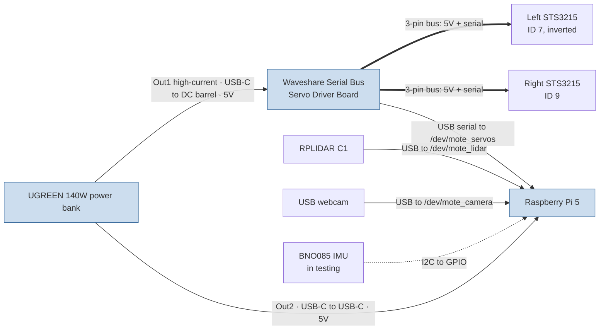

# Wiring & Power

How the Mote electronics connect. Everything runs from a single USB-C power
bank at **5 V** (see [the 5 V-only rationale](README.md#power-5v-only)). Device
names in the launch stack (`/dev/mote_*`) are created by the udev rules in
[`mote_bringup/udev/`](../mote_bringup/udev/).

> ⚠️ Items marked **Verify** depend on the exact connectors on your units —
> confirm against your hardware before ordering cables.

## Diagram

Solid lines = power and/or wired data. The lidar, camera and IMU are powered by
the Pi over their data connection (USB / GPIO), not from the bank directly.

## Connections

### Power

| From (port) | Cable | To | Carries | Notes |
| --- | --- | --- | --- | --- |
| Bank **Out1** (100 W USB-C) | USB-C → DC 5.5×2.1 mm barrel, **5 V** | Servo board DC input | 5 V power | Must be the higher-current 5 V port — servos brown out on Out2 (see Power notes) |
| Bank **Out2** (45 W USB-C) | USB-C ↔ USB-C, 0.3 m | Pi 5 USB-C power in | 5 V power | Pi negotiates 5 V/5 A |
| Servo board | 3-pin servo lead | Left STS3215 (**ID 7**) | 5 V + 1 Mbaud serial | Left wheel is mounted inverted (sign handled in firmware) |
| Servo board | 3-pin servo lead | Right STS3215 (**ID 9**) | 5 V + 1 Mbaud serial | Servos share the bus; can be daisy-chained |

### Data

| From | Cable | To | Device node | Notes |
| --- | --- | --- | --- | --- |
| Servo board (USB data) | USB-A ↔ USB-C, 0.3 m | Pi USB-A | `/dev/mote_servos` | CH343 USB-serial, 1 Mbaud. **Verify** board-side connector |
| RPLIDAR C1 | USB (incl. SLAMTEC adapter) | Pi USB-A | `/dev/mote_lidar` | 460800 baud; powered over USB. **Verify** cable supplied with unit |
| USB webcam | USB-A (captive) | Pi USB-A | `/dev/mote_camera` | UVC; powered over USB |
| BNO085 (testing) | 4× jumper to GPIO header | Pi GPIO | `/dev/i2c-1` | See IMU section |

The Pi 5 has 4 USB ports (2× USB-3, 2× USB-2). Servo board, lidar and camera
take three of them; keep the lidar on its own controller if you see scan
dropouts under load.

## Power notes (the fiddly bit)

Three things make the 5 V budget non-obvious:

1. **Servos are run below their rated voltage.** The STS3215's spec operating
   range is **7.4–12.6 V**, but Mote feeds the servo board **5 V**. This is the
   deliberate 5 V-only design tradeoff: it works in practice (the `velocity_scale`
   in [`robot.yaml`](../mote_description/config/robot.yaml) is calibrated on real
   hardware with `velocity_cal`), but you get less torque/speed headroom than the
   datasheet figures, which are quoted at the higher voltage. If you ever find
   the drive underpowered, this is why.

2. **A "100 W" USB-C port is not 100 W at 5 V.** USB-C PD advertises its top
   wattage at high voltage (≈20 V); at 5 V each port is limited by its 5 V
   current profile — commonly 5 V/3 A (15 W), sometimes 5 V/5 A (25 W). That is
   why the servo board must sit on **Out1**: under drive (and especially toward
   stall) the two servos draw more 5 V current than the 45 W **Out2** port will
   source, and they brown out. This matches the empirical note in
   [README.md](README.md#power-bank-form-factor).

3. **Confirm the barrel cable's profile.** The USB-C→DC cable must request 5 V at
   enough current from Out1. **Verify** it negotiates 5 V (not 9/12 V, which
   would over-volt the board) and sustains the servo load on your bank.

### Rough 5 V budget

| Load | Rail | Typical | Peak | Fed from |
| --- | --- | --- | --- | --- |
| Raspberry Pi 5 | 5 V | 5–10 W | up to ~25 W (5 V/5 A) | Out2 |
| 2× STS3215 (driving) | 5 V via board | ~2–6 W | high near stall | Out1 |
| RPLIDAR C1 | 5 V via Pi USB | 1.15 W (230 mA) | — | Pi |
| USB webcam | 5 V via Pi USB | ~0.5–1 W | — | Pi |
| BNO085 IMU | 3.3 V via GPIO | <0.1 W | — | Pi |

> ⚠️ Servo stall current at 5 V isn't published (datasheets quote 2.7 A at the
> rated voltage). Treat the servo column as the variable one and size headroom
> accordingly — measuring it on the bench is the only way to pin it down.

## IMU (BNO085) — in testing

I²C is the simplest of the BNO085's interfaces. Header pins must be soldered to
the breakout first (see [BOM](BOM.md)).

| BNO085 pin | Pi 40-pin header | GPIO |
| --- | --- | --- |
| VIN | pin 1 (3V3) | — |
| GND | pin 6 (GND) | — |
| SDA | pin 3 | GPIO 2 |
| SCL | pin 5 | GPIO 3 |

Enable I²C (`raspi-config` → Interfaces, or `dtparam=i2c_arm=on`); the BNO085
appears at address `0x4A` (or `0x4B`) — check with `i2cdetect -y 1`. Intended use
is wheel-slip detection / odometry fusion via `robot_localization`.

> ⚠️ **Verify** your breakout's logic/voltage: most BNO085 boards have an
> onboard regulator and accept 3–5 V on VIN, but confirm yours before wiring to
> 3V3 vs 5V.
