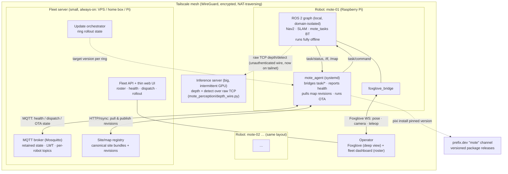

# Fleet architecture

How Mote robots are operated **completely remotely** — live map + location feed,
task dispatch, health, software updates — with **multiple robots assumed from
day one**, not retrofitted later.

This is a design document. No implementation lands with it; the milestone
breakdown at the end is sized so each milestone becomes one dispatchable task.

> **Scope note.** Everything here builds on seams that already exist in the repo
> — Sites (`mote_bringup/mote_bringup/sites.py`), the task layer
> (`mote_tasks/mote_tasks/task_server.py`), the inference wire
> (`mote_perception/mote_perception/depth_wire.py`), and the pending prefix.dev
> release channel (`pixi.toml:3`). Where a recommendation leans on one of those,
> the file and line are cited. Claims about candidate technologies link their
> docs; anything I could not verify is flagged **(verify)**.

---

## Where we are today

A single robot, and the fleet layer is greenfield in the two places that matter:

- **One hardcoded robot.** `pixi run sync` rsyncs the source tree to
  `michael@auldbot:~/Mote/` (`pixi.toml:26`) and it is built on the Pi. The docs
  call the SSH host `mote` (`README.md`, `CLAUDE.md:22`) but the committed sync
  string says `auldbot` — the name is already drifting, and there is **no
  `robot_id`, no per-robot ROS namespace, and no per-robot DDS domain** anywhere
  in the tree. The only per-machine state is `~/.mote/active.yaml`
  (which site/floor the robot is on — `sites.py:4`), and that is *location*
  state, not identity.
- **One flat, unconfigured DDS graph.** `RMW_IMPLEMENTATION=rmw_cyclonedds_cpp`
  is set once, globally, in the pixi activation env (`pixi.toml:219-221`). There
  is **no CycloneDDS XML** anywhere, `ROS_DOMAIN_ID` is never set (defaults to 0),
  and remote interaction today is "put the workstation on the same LAN and the
  same domain and let multicast discovery find everything"
  (`mote_perception/config/README.md:49-51`). That works on a bench. It does not
  cross a NAT, a firewall, or a second site, and it does not isolate two robots.

So the fleet layer is not a refactor of something — it is new surface. The job of
this design is to add that surface **without disturbing the parts of the robot
that already work offline**: Nav2, SLAM, and the `mote_tasks` behaviour tree all
run locally today and must keep running with the fleet server unplugged.

---

## The one-paragraph answer

Put every robot, the fleet server, the operator's machine, and the GPU inference
box on a **single WireGuard mesh (Tailscale)** so the LAN-vs-internet distinction
disappears and everything below rides an encrypted, NAT-traversing, identity-bearing
network for near-zero effort. On that mesh: each robot runs a small **`mote_agent`**
that is the *only* thing talking to the fleet server — it bridges the existing
`task/command` / `task/status` topics and reports health over **MQTT**, while the
robot's autonomy keeps running locally if the link drops. Adopt **Foxglove** (via
`foxglove_bridge`) as the deep single-robot console — live pose, camera peek,
teleop — and **build only a thin fleet dashboard** for the roster + dispatch view
Foxglove doesn't provide. The **fleet server is the central site/map registry**;
because Sites are already immutable file bundles distributed by an atomic symlink
flip (`sites.py:248-252`), map distribution is "copy a revision dir, flip a link."
Updates consume the pending **prefix.dev `mote` channel** (`pixi.toml:3`) —
install-alongside, health-check, keep the old env for rollback — so there is one
update mechanism, not two. Keep the **fleet server and the inference server as
separate roles** (small always-on vs big intermittent GPU); they may co-locate but
scale independently.

---

## Component diagram



---

## The seven questions

### 1. Topology — per-robot agent + central fleet server

**Recommendation.** Each robot runs a lightweight **`mote_agent`** (a systemd
service alongside the existing ones — `mote_bringup/systemd/` already holds
`mote-bringup`, `mote-slam`, `mote-nav`, `mote-record`, so a `mote-agent.service`
is the established pattern). The agent is the *only* process that talks to the
fleet server. A central **fleet server** hosts the site/map registry, the task
dispatch + telemetry control plane, the update orchestrator, and the operator
API/UI.

**The agent is a bridge and reporter, never in the control loop.** This is the
load-bearing property. The robot's autonomy already runs entirely locally: the
`mote_tasks` behaviour tree ticks on a timer inside `task_server` and drives Nav2
directly (`task_server.py`), SLAM and localisation are local nodes, and the active
site/floor + map live on-disk in `~/.mote` (`sites.py:88-97`). None of that
depends on the fleet server. So when connectivity drops:

- the robot keeps executing its current mission and stays navigable;
- the agent buffers health/telemetry and reconnects (MQTT's retained + LWT
  semantics, below, make "went offline / came back" clean);
- inbound commands are acked so a dropped command is neither lost nor
  double-applied.

**Fleet server vs inference server: separate roles.** The task brief asks whether
they are the same box. They should be **distinct roles**, because their shape is
opposite:

| | Fleet server | Inference server |
|---|---|---|
| Uptime | always-on | up only when a robot needs perception |
| Compute | tiny (broker, files, a web app) | heavy GPU (torch: OWLv2, Depth-Anything) |
| Hardware | VPS / home box / even a spare Pi | Windows/NVIDIA gaming PC |
| Trust | holds fleet secrets, operator auth | runs an **unauthenticated** wire protocol |

That last row is decisive. The inference wire is explicitly *"unauthenticated;
run it on a trusted network"* (per the inference server; the node opens a plain
`AF_INET`/`SOCK_STREAM` connection to `inference_host:server_port`,
`depth_wire.py:88-91`), and it is deliberately **decoupled from ROS/DDS**
(`depth_wire.py:9-14`) with the host chosen by config so *"inference can move
machines without editing launch"* (`CLAUDE.md:120`, `perception.yaml:8`). Keeping
it a separate role means its box can be off half the day without touching fleet
availability, and its unauthenticated port is never something the fleet server has
to firewall around — the Tailscale substrate (Q2) makes "trusted network" true
across the internet for free. They *may* co-locate on one physical machine at home
today; the design just refuses to *assume* it.

---

### 2. Transport — Tailscale substrate, Foxglove for rich data, MQTT for control

This is the crux, and the right answer is **layered**, not a single protocol.

#### Layer 0 — network substrate: Tailscale (WireGuard mesh) on everything

Put the robots, the fleet server, the operator machine, and the inference box on
one [Tailscale](https://tailscale.com/) tailnet. This is the single
highest-leverage decision in the whole design, because it dissolves the problem
every other transport option otherwise has to solve individually:

- **Off-LAN / NAT / firewall "just works."** WireGuard establishes direct
  encrypted tunnels between devices on different networks behind firewalls with
  *no port forwarding and no public exposure*
  ([Tailscale on Raspberry Pi](https://tailscale.com/learn/how-to-ssh-into-a-raspberry-pi)).
  The messy NAT question that Zenoh, Foxglove-remote, rosbridge, and MQTT each
  answer differently stops being N problems and becomes one.
- **Cheap on a Pi.** WireGuard is a kernel module; idle cost is negligible, which
  matters on the Pi that is already carrying Nav2 + SLAM + perception.
- **Stable identity + encryption for free.** Every device gets a stable MagicDNS
  name and an always-on encrypted link, and the free tier covers **100 devices /
  3 users with ACLs, MagicDNS, and subnet routing** — comfortably a hobby fleet
  (see Tailscale pricing; **verify** current free-tier limits at adoption time).
- **It directly fixes today's model.** The current "same LAN + same
  `ROS_DOMAIN_ID`" workflow (`mote_perception/config/README.md:49-51`) becomes
  "same tailnet" — the workstation, and now the fleet server, reach the robot as
  if on one LAN from anywhere.

Everything below assumes this substrate. It is why the app-layer choices can stay
simple.

#### Layer 1 — rich live data + teleop: Foxglove (adopt, don't build)

Run [`foxglove_bridge`](https://docs.foxglove.dev/docs/visualization/ros-foxglove-bridge)
on each robot (a ROS 2 Jazzy package; available on RoboStack **(verify the exact
`ros-jazzy-foxglove-bridge` build on robostack-jazzy)**). It speaks the
[Foxglove WebSocket protocol](https://foxglove.dev/robotics/rosbridge) — like
rosbridge but with ROS 2 `.msg`/`.idl` schema support, parameters, and graph
introspection, and *faster* than rosbridge. Foxglove is the operator's **deep
single-robot console**: live pose on the floor map, `/tf`, camera peek
(the camera already publishes `/image_raw/compressed`, `CLAUDE.md`), raw topic
inspection, and **teleop** (publishing back to the robot is supported over the
WS protocol).

Two ways to reach it, both fine on the tailnet: connect Foxglove desktop/web
directly to `wss://<robot-magicdns>:8765`, or use Foxglove's own device-token
remote path (`FOXGLOVE_DEVICE_TOKEN`) if we later want their cloud in the loop.
Foxglove's free tier is **5 connected devices, unlimited viewers, live
connections** (see [Foxglove pricing](https://foxglove.dev/pricing)) — enough for
a small fleet, with a clear paid upgrade if it grows. This is a **buy/adopt**, not
a build: reimplementing a ROS visualiser + teleop console is a large project with
no payoff.

#### Layer 2 — fleet control plane: MQTT (`mote_agent` ↔ fleet server broker)

The structured control plane — enrollment, task dispatch, health heartbeats,
update state — is a different shape from live visualisation: many robots, small
messages, and semantics that want *durability*. Use **MQTT** (Mosquitto broker on
the fleet server; both [mosquitto](https://anaconda.org/conda-forge/mosquitto) and
[paho-mqtt](https://anaconda.org/conda-forge/paho-mqtt) are on conda-forge, so the
agent stays inside the pixi solve). MQTT is the right fit because its native
features *are* the fleet semantics we need, rather than things we'd hand-build:

- **Last Will & Testament** → a robot that drops off is detected *instantly* by
  the broker publishing its will, without polling.
- **Retained messages** → the last-known health/pose of every robot is available
  the moment the dashboard connects; no "wait for the next heartbeat."
- **Per-robot topic namespacing** → `mote/<robot_id>/health`,
  `mote/<robot_id>/task/command`, `mote/<robot_id>/task/status`,
  `mote/<robot_id>/ota/state`. Multi-robot from day one falls out of the topic
  tree.
- **Cheap fan-out at the broker**, and cheap on the Pi.

The bridge is trivial because the dispatch seam is already string-shaped:
`task/command` and `task/status` are both `std_msgs/String`
(`task_server.py:56-57`), with the grammar `fetch <target> <drop_zone>` in and
status strings (`accepted:`/`rejected:`/`succeeded:`/`failed:`) out
(`task_server.py:83-97`). The agent JSON-wraps those onto MQTT and back — no new
ROS message types, no changes to `task_server`.

> A single persistent WebSocket/HTTP from agent to fleet server is the honest
> fallback for a tiny fleet, but you would then reimplement LWT and retained
> state by hand. A Mosquitto broker is a ~10-minute setup that gives both for
> free, so MQTT is the recommendation.

#### Layer 3 — inference: unchanged, now on the tailnet

The depth/detect link stays exactly as built — raw length-prefixed TCP on ports
5601/5602 (`depth_wire.py:16-31`, `detect_wire.py:27-29`), `inference_host` from
`perception.yaml` (`perception.yaml:8`). The only change is that `inference_host`
now points at the GPU box's **MagicDNS name**, so the "run it on a trusted
network" requirement is satisfied across the internet by the tailnet. Nothing in
the perception code changes.

#### Rejected / deferred alternatives

- **rmw_zenoh (swap the RMW).** Promising, but *not production-ready for Jazzy* —
  the maintainers state it is "mostly feature-complete" but still changing, with
  the first supported release targeted at **Kilted** (the distro after Jazzy)
  ([rmw_zenoh binaries announcement](https://discourse.openrobotics.org/t/rmw-zenoh-binaries-for-rolling-jazzy-and-humble/41395)).
  Swapping the robot's working RMW is a high-blast-radius change to a stack that
  ships today on `rmw_cyclonedds_cpp` (`pixi.toml:221`). **Defer; revisit at
  Kilted.**
- **zenoh-plugin-ros2dds (DDS↔Zenoh bridge).** A genuinely strong *alternative*
  to Foxglove-as-transport if we ever want full ROS-graph bridging *between*
  robots, and notably it is *"tested with `RMW_IMPLEMENTATION=rmw_cyclonedds_cpp`"*
  ([zenoh-plugin-ros2dds](https://github.com/eclipse-zenoh/zenoh-plugin-ros2dds)) —
  exactly Mote's RMW — with per-robot namespace prefixing and TLS/ACLs available
  at the Zenoh layer ([Zenoh access control](https://zenoh.io/docs/manual/access-control/),
  [Zenoh TLS](https://zenoh.io/docs/manual/tls/)). It is kept as the **documented
  fallback**: if the fleet later needs cross-robot topic sharing that MQTT +
  Foxglove don't cover, this is the path, and it slots onto the same tailnet. For
  v0/v1 it is more moving parts than the job needs.
- **rosbridge.** Older JSON protocol, no schema support, slower than Foxglove WS
  ([What is ROSBridge?](https://foxglove.dev/robotics/rosbridge)). Foxglove WS
  supersedes it. Note only as a compatibility fallback.
- **Raw DDS over the WAN.** Fragile (multicast discovery, discovery floods, no
  NAT story). The tailnet could tunnel it, but per-robot domain isolation is
  unsolved today (`ROS_DOMAIN_ID` never set) and DDS-over-WAN is not worth the
  operational risk when MQTT + Foxglove cover the need.

---

### 3. Identity & provisioning — a `robot_id`, per-robot state stays in `~/.mote`

**Recommendation.** Introduce a stable **`robot_id`** as the fleet's primary key,
decoupled from the hostname (which is already ambiguous — `auldbot` in
`pixi.toml:26` vs `mote` in the docs). Store it in a new
**`~/.mote/robot.yaml`**, sitting alongside the `active.yaml` that already lives
there (`sites.py:4`) and honouring the same `MOTE_HOME` override
(`sites.py:63-64`) so tests and sim can fake it:

```yaml
# ~/.mote/robot.yaml   (per-robot, never in the repo/package)
id: mote-01            # stable primary key; keys every MQTT topic + registry entry
name: "Front desk"     # human label shown in the ops UI
domain_id: 1           # per-robot ROS_DOMAIN_ID (fixes the flat-graph problem)
```

Adding `domain_id` here also closes the second greenfield gap: today all robots
would share the default domain 0. Having each robot set its own `ROS_DOMAIN_ID`
from `robot.yaml` gives DDS-level isolation between robots on the same LAN, on top
of the tailnet.

**Per-robot vs shared config — formalise the split that already exists.** Shared
*code + config* ships identically to every robot via the prefix.dev package
(Q6). Per-robot *state* stays in `~/.mote`, which is already the pattern:
`active.yaml` (site/floor), `camera_calibration.yaml`, and the uncommitted
`perception.yaml` override all live there and are all `MOTE_HOME`-relative
(`perception.yaml:5-6`, `CLAUDE.md`). `robot.yaml` joins that set. The clean
consequence: **an update can never touch identity**, because updates replace the
package and `~/.mote` is outside it.

**Enrollment flow (new robot):**

1. Prepare the Pi and run the existing one-time `pixi run setup` (udev, wifi,
   systemd — `CLAUDE.md`).
2. `tailscale up` with a pre-authorised key → the robot joins the tailnet and
   gets a MagicDNS name.
3. `mote enroll` (new CLI, sibling to the existing `site` console script) writes
   `robot.yaml` with an assigned `id`/`name`/`domain_id` and registers with the
   fleet server; the server records the robot (keyed by `robot_id`, *not*
   hostname) and pushes the appropriate site bundle (Q4).
4. The robot appears in the ops roster.

MagicDNS handles reachability; `robot_id` handles identity; the legacy `auldbot`
hostname becomes irrelevant to the fleet layer.

---

### 4. Site/map registry — fleet server is source of truth, distribute by revision

**Recommendation.** The **fleet server is the canonical registry** of sites,
floors, and map revisions. This is barely new work, because Sites were *designed*
for it: the module docstring states the whole bundle is *"plain files + YAML so it
can be zipped, synced, or served by a web API without translation"*
(`sites.py:33-35`).

**Distribution = copy an immutable revision dir + one atomic flip.** A map
revision is a timestamped directory `floors/<floor>/maps/<rev>/`, *immutable once
published* (`sites.py` docstring), and the live map is a symlink flipped by an
atomic `os.replace` (`sites.py:248-252`):

```python
tmp = fdir / f".map-{os.getpid()}"
os.symlink(os.path.join("maps", rev), tmp)
os.replace(tmp, fdir / "map")          # atomic publish
```

So a robot pulling a new map from the server = "download the `maps/<rev>/`
directory, then flip the local `map` link" — and the existing revision model
guarantees a **half-transferred revision is never visible** and rollback is a flip
to an older rev (the exact semantics of `site use-map <rev>`,
`sites.py:426-434`). The agent reuses this machinery rather than inventing map
sync. `KEEP_REVISIONS = 3` (`sites.py:60`) already bounds local disk.

**Who may publish.** A robot finishes a mapping session and runs `save-map`, which
produces a new *local* revision with `map.yaml`+`map.png`, the raw PNG, the
slam_toolbox posegraph, and a `meta.yaml` provenance record (`sites.py:348-410`).
The agent then **uploads that revision to the fleet server**, which validates it
and, if accepted, publishes it as the new **canonical** revision for that floor.
Publishing is **server-gated: one writer wins.** Other robots pull the canonical
revision on their next sync.

**Conflict: two robots map the same floor.** Do **not** auto-merge. Revisions are
immutable and independent, and — critically — a map frame's origin is *"an
accident of where SLAM started, so zones/map/posegraph must live and travel
together"* (`sites.py` docstring). Two mapping runs produce two frames; merging
them silently would break every taught zone coordinate. Instead: the server keeps
both as **candidate revisions**, and an operator **promotes** one to be the
floor's active revision — the same `site use-map` semantics, centralised. Nothing
is lost, nothing is silently merged, and the loser's revision is retained for
audit (matching the raw-map-retention ethos already in `save-map`).

**`active.yaml` stays per-robot.** The *registry* of sites/floors/revisions is
central, but which floor a given robot is currently on is local state
(`sites.py:88-104`) — two robots can be on different floors of the same site at
once.

**PNG maps are a distribution asset, not just a rendering one.** Maps are PNG *by
design* so a browser can render them directly (`sites.py` docstring, `CLAUDE.md`).
That means the thin fleet UI (Q5) can show a floor map with a live pose dot
without any tiling/vector pipeline — the registry serves the PNG, the UI draws a
dot on it.

---

### 5. Live operations UI — adopt Foxglove for depth, build a thin fleet roster

**Recommendation: hybrid.** Adopt Foxglove for deep single-robot inspection;
**build only the fleet-level view Foxglove doesn't provide.**

- **Adopt Foxglove** (Q2) for the rich per-robot view: live pose on the floor map,
  camera peek, teleop, raw topic inspection. Zero build, ROS-native, remote-access
  built in, free tier covers a small fleet.
- **Build a thin fleet dashboard** — the "minimum lovable" operator view — for the
  one thing Foxglove is not: the **fleet roster**. A small web app on the fleet
  server showing every robot with **online/health/battery/current-task**, a
  per-robot **map + pose overlay** (PNG from the registry + a dot from the
  retained MQTT pose — both cheap, per Q4), a **dispatch box** (publish
  `fetch <target> <drop_zone>` to `mote/<robot_id>/task/command`), and a
  **deep-link into Foxglove** for that robot.

The seam makes this small: the dashboard is a thin client over the MQTT control
plane (retained health topics → roster; publish → dispatch) plus the registry's
PNG maps. It is emphatically **not** a rebuild of Foxglove, and Foxglove is
emphatically **not** asked to be the fleet roster (it is per-connection, not a
fleet database). Each tool does the half it is good at.

---

### 6. Updates — one mechanism, the prefix.dev channel, install-alongside + rollback

**Recommendation.** Consume the **versioned prefix.dev `mote` channel** — already
listed as a channel (`pixi.toml:3`), with the parallel Voro task productionizing
`pixi-build-ros` → that channel (`README.md`). The robot's software *is* a pixi
environment resolved from that channel, so an update is *"resolve a new pinned
version and re-activate"* — **there is exactly one update mechanism**, satisfying
the brief's "consume it, don't invent a second." (Today there is no update
mechanism at all — deploy is rsync-then-build-on-Pi, `pixi.toml:26`,
`mote-bringup.service`; this replaces that.)

**Flow (per robot, driven by the agent):**

1. Agent reports its **current version** on `mote/<robot_id>/ota/state`.
2. Operator sets a **target version for a rollout ring** (canary → stable).
3. When told to update, the agent **installs the new version alongside the
   current one** (a new pixi prefix / env, pinned by the lockfile — old env
   untouched), then runs a **post-update health check** (does it launch? do the
   controllers come up? a `sim-test`-style smoke gate).
4. If healthy, **flip a `current` pointer** to the new env (the same
   install-new-beside-old-then-flip pattern the map registry uses,
   `sites.py:248-252`); if the health check fails **or the robot doesn't check
   back in**, **revert to the previous env**. The previous prefix is retained for
   exactly this.
5. Agent reports each transition — `idle → downloading → staged → activating →
   healthy | rolled-back` — up the control plane.

**Staged rollout.** Robots belong to a **ring** (canary/stable). The server holds
a ring until the canary reports `healthy` for N minutes, then advances. Because
`robot_id` keys everything and health is reported, this is bookkeeping on the
server, not new robot code.

**Identity is safe across updates.** `~/.mote` (robot.yaml, active.yaml, sites,
calibration) is outside the package (Q3), so an update *cannot* clobber a robot's
identity, site selection, or maps. That is a property we get for free from the
existing repo-vs-`~/.mote` split.

> **(verify)** Whether prefix.dev supports package signing. If it does, verify
> signatures on-robot as the code trust root. If not, the trust root is
> account-scoped channel access + the pinned lockfile hashes + the tailnet — call
> this out rather than assume signing.

---

### 7. Security — proportionate, and mostly free from the substrate

**Recommendation.** Lean on the Tailscale substrate for the baseline and add
per-channel auth on top; do **not** build a PKI or a custom auth server for v1.

- **Transport encryption is free (WireGuard).** Every robot↔server, robot↔
  inference, and operator↔robot link rides an encrypted WireGuard tunnel, and
  **nothing robot-side is exposed to the public internet** — no port forwarding,
  no public ports. This deletes an entire class of risk, and it is what makes the
  **unauthenticated** inference wire (`depth_wire.py`, "run it on a trusted
  network") safe across the internet.
- **Authorization via Tailscale ACLs.** Scope who/what can reach what: operators
  and the fleet server can reach a robot's Foxglove port and MQTT; robots reach
  the broker and the inference box but not each other unless a future feature
  needs it. ACLs are in the free tier.
- **Per-channel auth on top of the tunnel:**
  - **MQTT** — per-robot broker credentials (username = `robot_id`) or mTLS.
  - **Foxglove remote** — its device token (`FOXGLOVE_DEVICE_TOKEN`).
  - **Fleet API/UI** — operator auth (start with a simple token or GitHub/OIDC;
    escalate only if needed).
  - **Updates** — pinned exact versions via the pixi lockfile so a robot only runs
    a resolved, hashed package set; package signing if prefix.dev offers it
    (Q6 **verify**).
- **Proportionality.** This is a small trusted fleet, not a public product. mTLS
  everywhere and a custom PKI are deferred until the fleet operates *outside* the
  trusted overlay. Note that Zenoh's TLS is *hop-by-hop, not end-to-end*
  ([Zenoh security analysis](https://census-labs.com/news/2025/03/17/zenoh-protocol-security-analysis/))
  — a reason the encryption baseline lives at the WireGuard layer, which is
  end-to-end between tailnet peers, rather than depending on an app-layer bridge's
  TLS.

---

## Non-goals for v1

Explicitly **out of scope** for the first fleet, to keep each milestone shippable:

- **No multi-robot traffic coordination.** No centralised path planning, no
  deconfliction, no fleet traffic manager. Each robot navigates independently.
  (This is the big Locus-style capability; deliberately deferred.)
- **No automatic map merging.** Two mappers → two candidate revisions → an
  operator promotes one (Q4). No auto-merge, ever.
- **No cross-robot task allocation/optimization.** An operator (or a trivial
  queue) assigns a task to a *specific* robot. No auctioning/bin-packing.
- **No cloud data lake / long-term bag pipeline.** Bags stay local
  (`~/.mote/bags/`, `sites.py`); Foxglove's storage covers spot inspection.
- **No public-internet-exposed services.** Everything on the tailnet. No custom
  PKI.
- **No safety-rated remote e-stop or high-rate teleop SLA over WAN.** Teleop is
  best-effort; all safety behaviour stays local on the robot.
- **No RMW swap.** `rmw_cyclonedds_cpp` stays; rmw_zenoh revisited at Kilted (Q2).

---

## Milestones

Each milestone is sized to be **one dispatchable Voro task**. The v0 line is "one
robot fully remotely operable off-LAN"; the v1 line is "second robot enrolled."
Security (M7) is cross-cutting — its hardening can fold into each milestone, but it
is called out so it isn't forgotten.

### v0 — one robot, fully remotely operable off-LAN

- **M0 · Overlay + identity foundation.** Tailscale on robot + workstation + fleet
  box. Introduce `~/.mote/robot.yaml` (`id`/`name`/`domain_id`), a `mote enroll`
  CLI, and wire `ROS_DOMAIN_ID` from it. Formalise the per-robot (`~/.mote`) vs
  shared (package) config split.
  *Accept:* robot reachable by MagicDNS from off-LAN; `robot_id` stable across
  reboots; two processes on different domains don't cross-talk.
  *Seams:* `sites.py:63-104` (`~/.mote` state, `MOTE_HOME`), `pixi.toml:219-221`.

- **M1 · `mote_agent` + control plane.** New `mote-agent.service`; Mosquitto on
  the fleet server; agent publishes health/heartbeat (with LWT) and bridges
  `task/command`↔`task/status` to `mote/<robot_id>/…`.
  *Accept:* dispatch a `fetch` and observe status transitions, from off-LAN, over
  MQTT.
  *Seams:* `task_server.py:56-57` (String topics), `:83-97` (status grammar);
  `mote_bringup/systemd/` (service pattern).

- **M2 · Foxglove observability + teleop.** `foxglove_bridge` on the robot; a
  Foxglove layout for pose-on-PNG-map + camera peek + teleop.
  *Accept:* operator drives the robot and watches its camera/pose remotely.
  *Seams:* PNG maps (`sites.py` docstring), `/image_raw/compressed` (`CLAUDE.md`).

- **M3 · Thin fleet UI.** Web app on the fleet server: roster with health, a
  per-robot map+pose overlay, a dispatch box, and a Foxglove deep-link.
  *Accept:* the "minimum lovable" operator view works for one robot, fully off-LAN.
  *Seams:* retained MQTT health/pose (M1), registry PNG maps (Q4).
  **← end of v0.**

### v1 — second robot enrolled, plus the shared-infrastructure milestones

- **M4 · Central site/map registry + distribution.** Fleet server stores canonical
  site bundles; agent pulls revisions (stage dir + atomic flip) and uploads new
  revisions from `save-map`; operator promotes a floor's active revision.
  *Accept:* map a floor on the robot, publish it, and have the robot re-pull the
  canonical revision; a second candidate revision is retained, not merged.
  *Seams:* `sites.py:248-252` (atomic flip), `:348-410` (`save-map`),
  `:426-434` (`use-map`).

- **M5 · OTA updates via prefix.dev.** Agent reports version; server drives
  ring rollout; install-alongside + health-check + rollback; report update state.
  *Accept:* push a new version to a canary; auto-rollback on a failed health
  check; stable ring only advances after the canary is healthy.
  *Seams:* `pixi.toml:3` (channel), the `~/.mote`-vs-package split (Q3).
  *Depends on:* the parallel prefix.dev release task producing versioned packages.

- **M6 · Second robot enrollment (multi-robot hardening).** Enroll `mote-02`;
  verify per-robot MQTT namespacing, domain isolation, and registry sharing
  end-to-end; fleet UI shows two robots; exercise the two-mapper conflict/promote
  flow.
  *Accept:* two robots dispatched independently from one UI; the roster and maps
  are correct for both.
  **← v1 complete.**

- **M7 · Security hardening (cross-cutting).** Tailscale ACLs; per-robot broker
  credentials / mTLS; Foxglove tokens; operator auth on the fleet API; pinned +
  (if available) signed packages.
  *Accept:* a device not on the tailnet cannot reach any robot or the broker; a
  robot cannot read another robot's command topic.

---

## Appendix — verification ledger

Claims grounded in the repo (cited inline) are verified. External claims flagged
**(verify)** before building on them:

- Tailscale free-tier limits (100 devices / 3 users / ACLs) — confirm current at
  adoption.
- `ros-jazzy-foxglove-bridge` exact availability/version on robostack-jazzy.
- Foxglove free-tier device count (5) and teleop-over-WS specifics — confirm
  against current Foxglove docs.
- prefix.dev package **signing** support — determines the OTA code trust root
  (Q6/M5).
- rmw_zenoh Jazzy production status — re-check at Kilted before reconsidering the
  RMW swap.
