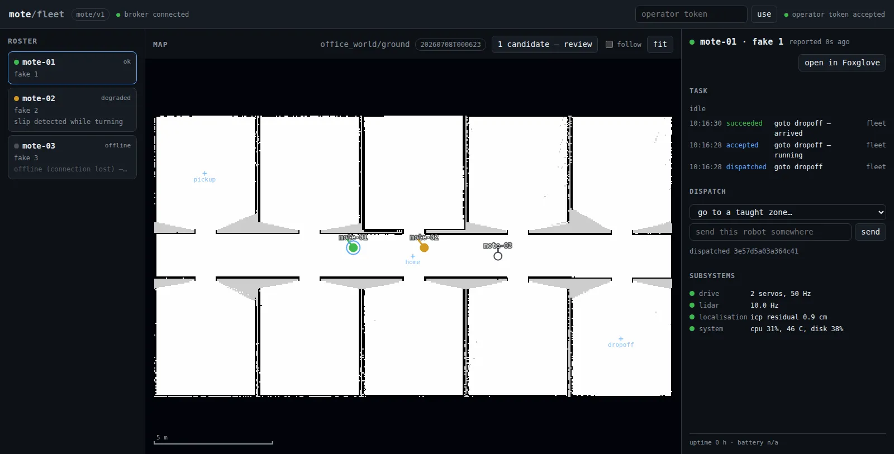
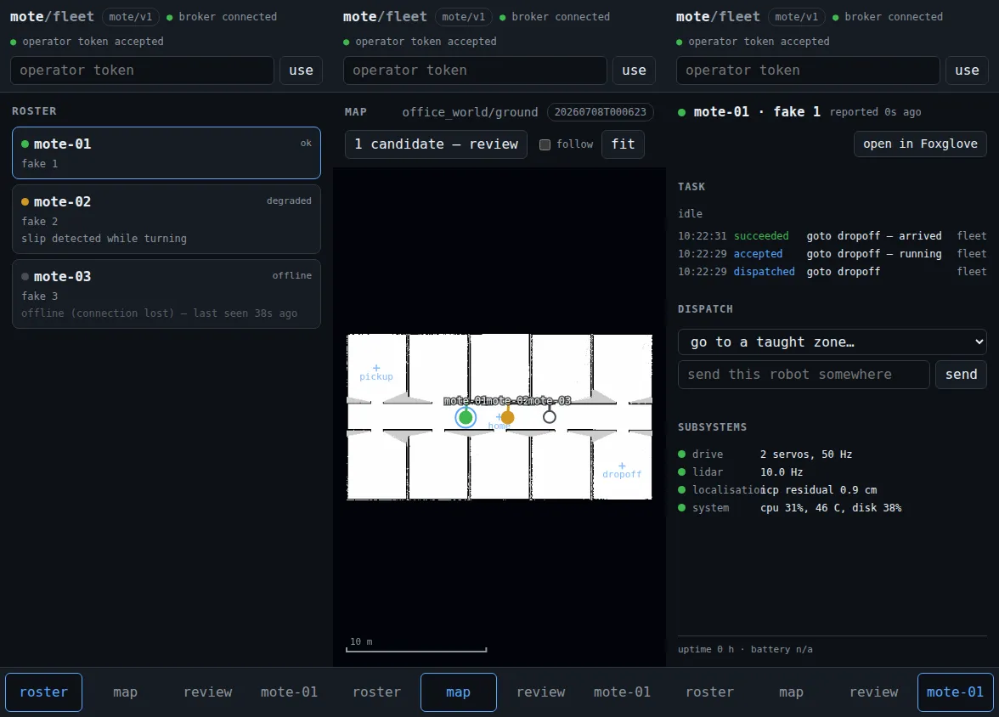

# Fleet — overlay, identity, control plane, and the operator view

The operator runbook for the fleet layer: a network where the LAN/internet
distinction has disappeared (**M0**), a stable name for each robot (**M0**), a
server that hands out those names and carries tasks and telemetry to and from
every robot (**M1**), a browser you watch and drive the fleet from (**M3**), a
deep console for one robot at a time (**M2**), and one place that owns every
site's maps (**M4**). The architecture and the milestones after these are in
[`docs/design/fleet.md`](../design/fleet.md); the measurements are in
[`m0-verification.md`](m0-verification.md),
[`m1-verification.md`](m1-verification.md),
[`m2-verification.md`](m2-verification.md),
[`m3-verification.md`](m3-verification.md) and
[`m4-verification.md`](m4-verification.md); the two wires are specified in
[`control-plane.md`](control-plane.md) (MQTT) and [`fleet-api.md`](fleet-api.md)
(HTTP).

| | |
|---|---|
| `pixi run identity` | this robot's `id` / `name` / `site` |
| `pixi run tailnet` | join this machine to the Tailscale overlay |
| `pixi run provision` | render cloud-init user-data for a clean Pi |
| `pixi run dds-check` | DDS participant-slot headroom on this host |
| `pixi run fleet-broker` | the MQTT control plane, with WebSockets (a container) |
| `pixi run fleet-server` | fleet API + operator dashboard (fleet box) |
| `pixi run fleetctl` | operator CLI: tokens, roster, dispatch, audit, watch |
| `pixi run enroll` | ask the server for this robot's identity |
| `pixi run agent` | the robot's bridge to the fleet |
| `pixi run publish-map` | offer this robot's saved map to the registry |
| `pixi run foxglove` | the robot's remote view + teleop (Foxglove WebSocket) |

**First time through**, in order: §1a (create the tailnet — browser, once, for
the whole fleet) → §1b (join your workstation and the fleet box) → §6 (stand up
the fleet server) → §7 (enroll a robot and start its agent) → §9 (open the
dashboard) → §10 (connect Foxglove and drive one) → §5 (every robot after this
one, unattended from a card). §11 is what to do after a mapping session.

§2 (typing an id by hand) is the M0 path, kept because it is what a robot with
no fleet server does; §7 supersedes it and adopts an already-set id rather than
renumbering it.

---

## 1. The overlay: one tailnet, no port forwarding

Every robot, the workstation, the fleet box and the GPU inference box join a
single [Tailscale](https://tailscale.com/) tailnet. WireGuard gives each of them
an encrypted, NAT-traversing link and a stable MagicDNS name, so "same LAN, same
`ROS_DOMAIN_ID`" becomes "same tailnet" and nothing is ever exposed to the public
internet.

### 1a. Creating the tailnet — the one-time account setup

Four things, all in the browser at
[login.tailscale.com](https://login.tailscale.com/admin), before any machine runs
`pixi run tailnet`. Ten minutes, once, for the whole fleet.

**1. Make the tailnet.** Sign up with whichever identity provider you already
use (Google / GitHub / Microsoft / Apple / email). Signing in *creates* the
tailnet — there is nothing to name or configure — and you get a tailnet domain
like `tail1a2b3.ts.net`. Everything below lives under that one account. The free
Personal plan covers a homelab fleet comfortably; check the current device and
user limits on the [pricing page](https://tailscale.com/pricing) at signup rather
than trusting a number written here, and note that the plan's *tagged*-device
allowance is the one that matters as robots multiply (see Cost & tradeoffs in
[`fleet.md`](../design/fleet.md)).

**2. Confirm MagicDNS is on.** Admin console → **DNS**. It is enabled by default
on new tailnets, and it is the thing that makes `ssh michael@mote-01` work — the
device's tailnet hostname becomes its name. Without it you are typing
`100.x.y.z` addresses everywhere.

**3. Declare the tags.** Admin console → **Access controls**, in the policy file.
Tags do not exist until an owner is declared for them, and `--advertise-tags` on
a machine fails with "requested tags are invalid or not permitted" if you skip
this:

```jsonc
{
  "tagOwners": {
    "tag:robot":     ["autogroup:admin"],
    "tag:fleet":     ["autogroup:admin"],
    "tag:inference": ["autogroup:admin"],
  },
  // The default policy already allows every device to reach every other, which
  // is what M0 wants. M7 replaces this with per-tag rules (operators reach
  // robots; robots reach the broker and their own inference box; robots cannot
  // reach each other).
}
```

**4. Mint an auth key per robot.** Admin console → **Settings → Keys → Generate
auth key**. For a robot:

| Option | Set it to | Why |
|---|---|---|
| Reusable | **off** | one key, one robot — a leaked key can enrol exactly nothing twice |
| Ephemeral | **off** | ephemeral nodes vanish when they go offline; a robot must persist |
| Expiration | **short** (a day is plenty) | it only has to survive from rendering the card to first boot |
| Tags | **`tag:robot`** | this is what makes the key mint a *tagged* device |

The key looks like `tskey-auth-…`; it goes into `pixi run provision --ts-authkey`
(or `pixi run tailnet --auth-key` on a machine you are sitting at). Keep the key's
tags and the `--role` you pass in agreement — a mismatch is rejected rather than
merged. The workstation needs no key at all: `pixi run tailnet --role workstation`
opens a browser to authenticate you.

**Why bother tagging the robots**, beyond ACLs: a *user* device's key expires
(180 days by default) and needs a human to re-authenticate it, which for a robot
means it silently drops off the tailnet one day months from now. Tagged devices
do not expire. That failure mode is the practical argument for `tag:robot`,
ahead of anything M7 does with it.

### 1b. Joining machines

```bash
# on the robot (identity must exist first — its id becomes the MagicDNS name)
pixi run tailnet --role robot --auth-key tskey-auth-...

# on the workstation (a user device, untagged)
pixi run tailnet --role workstation

# on the fleet box / the GPU box
pixi run tailnet --role fleet
pixi run tailnet --role inference
```

`tailscale up` is declarative, so re-running is a no-op — the script is safe to
run from provisioning and by hand.

**One machine, several roles.** A machine is one tailnet node, and `tailscale up`
replaces the whole tag set — so roles are passed *together*, never in two runs
(the second would silently drop the first's tag). A home box that is both the
fleet server and the GPU inference node is one call:

```bash
pixi run tailnet --role fleet,inference
pixi run tailnet --role fleet,inference --dry-run   # resolve roles/tags/hostname only
```

**Should your dev machine take those roles?** Only if you want it to stop being
*yours*. Advertising a tag transfers the node from your user account to the
tailnet, which needs a re-auth and drops key expiry — so `--role workstation` and
any tagged role are mutually exclusive and the script refuses the combination.
For one operator at one site, leave the dev machine an untagged workstation that
happens to run Mosquitto and the inference servers: nothing functional depends on
the tag (robots reach it by MagicDNS either way, and `inference_host` is just a
name). What you defer is M7's ACLs — a rule keyed on your user's device rather
than `tag:fleet`/`tag:inference`. Tag it when a second person or a second machine
appears and the roles want to outlive your account.

**Verify off-LAN** (the M0 acceptance test) — from a device on a *different*
network, e.g. a laptop tethered to a phone:

```bash
tailscale ping mote-01          # direct WireGuard path, or via a DERP relay
ssh michael@mote-01             # MagicDNS name == robot id
```

Once a robot is on the tailnet, its MagicDNS name works anywhere a hostname
does — including `pixi run sync`, whose target is still the legacy hardcoded
`michael@auldbot` (`pixi.toml`). Retargeting it at the robot id is a
one-line change to make when the current Pi is re-provisioned.

The per-device cost curve at fleet scale, and the self-hosted escape hatch
(Headscale), are in the design doc.

---

## 2. Identity: `robot_id` is the fleet's primary key

> Since M1 the **server allocates the id** — see [§7](#7-enrolling-a-robot).
> `identity set` remains the way to give a robot an id with no fleet server in
> the picture, and enrollment adopts whatever it finds rather than renumbering.

```bash
pixi run identity set --id mote-01 --name "Scout" --site home
pixi run identity show
pixi run identity id            # just the id, for scripts
```

writes `$MOTE_HOME/robot.yaml` (`~/.mote/robot.yaml` by default):

```yaml
schema: 1
id: mote-01
name: Scout
site: home
```

- The **id** keys everything downstream: the MQTT topic tree
  (`mote/<robot_id>/…`), the registry row, and the robot's MagicDNS name. It is
  constrained to a lowercase DNS label (letters, digits, hyphens, ≤32) because it
  has to be simultaneously a hostname, an MQTT topic level and a directory name.
- It is **not the hostname**. The hostname is already ambiguous in this repo
  (`auldbot` in `pixi.toml` vs `mote` in the docs), and re-imaging a Pi must not
  silently mint a new fleet member. Provisioning does set the OS hostname to the
  id for convenience, but nothing depends on that.
- It is **stable across reboots and across updates**: the file lives in
  `MOTE_HOME`, outside the package, so an update physically cannot touch it.
- `name` is a free-text label for the *robot*, so name it like an individual
  ("Scout") rather than a place ("Front desk") — places are already a concept
  here, and a robot label that reads like a zone name is a trap when both appear
  in the same dispatch UI. `site` says which site's map bundles this robot is
  entitled to. Both are optional to the software.

---

## 3. Per-robot state vs shared config

The rule, now enforced in one place
([`mote_bringup/mote_home.py`](../../mote_bringup/mote_bringup/mote_home.py)):
**shared config ships in the package; per-robot state lives under `MOTE_HOME`.**

| | Shared (package) | Per-robot (`$MOTE_HOME`, default `~/.mote`) |
|---|---|---|
| what | identical on every robot of a version | belongs to this machine |
| examples | `mote_description/config/robot.yaml` (wheel geometry, servo bus, device paths), `nav2_params.yaml`, `slam_toolbox_params.yaml`, `zones.default.yaml`, `camera_info.default.yaml`, `perception.yaml` | `robot.yaml` (identity), `active.yaml` (site + floor), `sites/…` (maps, zones, posegraphs), `bags/…`, `camera_calibration.yaml`, `perception.yaml` override |
| lifecycle | replaced wholesale by an update | survives every update |
| under version control | yes | no |

Two files are called `robot.yaml` and they are **not** the same thing:
`mote_description/config/robot.yaml` is the shared *hardware description*;
`$MOTE_HOME/robot.yaml` is this robot's *identity*.

Where a config has both halves, the per-robot file wins:
`mote_home.override("perception.yaml", packaged_default)`. Launch files use that
helper, so `MOTE_HOME` is honoured everywhere — which is what lets the sim point
it at an in-repo bundle and tests point it at a tmpdir.

The consequence the fleet layer needs: **an update can never clobber identity,
site selection, calibration, maps or bags.**

---

## 4. DDS: pinned to the robot, as of M2

DDS never leaves a robot running under systemd. Nothing off-box joins its ROS
graph, because the fleet layer bridges over MQTT (§7) and Foxglove (§10)
instead — so two robots parked on the same LAN cannot see each other's nodes
whatever their `ROS_DOMAIN_ID`, and there is no domain-id allocation problem at
any fleet size.

**M0 deliberately did not flip that switch**, because nothing on-robot replaced
an operator's RViz yet and pinning would have broken the one remote workflow
that existed. **M2 is what earns it**: `foxglove_bridge` is that off-box path,
and teleop was verified to work with the pin on *before* the pin was applied
([`m2-verification.md` §2](m2-verification.md)).

Where it applies, and where it does not:

- **the systemd units** carry `ROS_AUTOMATIC_DISCOVERY_RANGE=LOCALHOST` — every
  `mote-*.service`, beside the `CYCLONEDDS_URI` they already had. A robot that
  boots unattended is pinned. It is on all of them rather than just the new one
  because a localhost-range participant discovers a same-host default-range one
  but not the reverse, so a mixed set is asymmetric rather than half-safe;
- **an interactive `pixi run` keeps stock discovery**, but it no longer matters
  for LAN visibility: DDS *transport* is loopback-only in every pixi
  environment ([`cyclonedds.xml`](../../mote_bringup/config/cyclonedds.xml),
  loaded through `CYCLONEDDS_URI` by `[activation.env]` and repeated by the
  units), because a radio-pinned profile let a wifi flap stall topic delivery
  between processes on the robot's own board. LAN bench flows (workstation
  RViz, `pixi run teleop` from a laptop) are gone with it; camera calibration,
  the one flow that needs a LAN DDS peer, unsets the profile explicitly
  (`mote_perception/config/README.md`);
- **sims and benchmarks pin themselves** (`[feature.sim.activation.env]`), as
  before.

The consequence to know: **a machine on the LAN cannot see the robot's ROS
graph at all** — systemd-run or interactive. That is the intended trade — watch
it through Foxglove (§10).

The other thing M0 contributed here is the **measurement**, because the pin has a
ceiling worth knowing before we walk into it.

### The participant cap — check it before adding processes

Under `LOCALHOST`, rmw_cyclonedds hands CycloneDDS
`<ParticipantIndex>auto</ParticipantIndex><MaxAutoParticipantIndex>32</MaxAutoParticipantIndex>`:
each participant (one per ROS *process*, in practice) claims an index 0–32 and
binds UDP ports derived from it. **Past 32, participant creation fails, which
means node creation fails.**

```bash
pixi run dds-check          # or: --json for a machine-readable report
```

Measured on the sim nav mission: **17 of 33 slots**, stable for the whole run —
and the same 17 under stock discovery, so the tool reads correctly on the robot
as it runs today. The projected robot stack — nav mission with real drivers, plus
perception, plus M1's agent and `foxglove_bridge` — lands around **24**. That is
headroom, but not an unlimited amount, and it is spent *before* M2 arrives to
claim it. Re-run `dds-check` whenever a milestone adds processes; if it runs out,
raise `MaxAutoParticipantIndex` in the robot's existing `cyclonedds.xml`.

M1's agent has since been measured at **exactly one slot**, as projected
([`m1-verification.md` §3](m1-verification.md)). M2 costs **two** — the bridge
and the teleop relay, which the projection did not know about
([`m2-verification.md` §3](m2-verification.md)) — putting the full robot stack
around **25 of 33**.

Indices are released when a process exits, so what matters is the *concurrent*
peak; transient helpers (controller spawners, `ros2` CLI calls, the ROS daemon)
each take a slot while they run.

---

## 5. Provisioning a clean Pi

The image is stock Raspberry Pi OS plus **one file**: `user-data` on the boot
partition. Raspberry Pi Imager 2.0+ writes cloud-init user-data for its own
OS-customisation, so this replaces that dialog rather than sitting beside it.

**Everything up to "boot the Pi" happens on the workstation, against the SD card
mounted there.** The Pi runs nothing until it boots; it has no pixi, no network
config and no repo. `pixi run provision` is a workstation command that writes a
file onto the card — it never runs on the robot. The wifi *is* configured, by the
template, which is precisely why the Imager dialog is skipped: Imager would write
its own `user-data` to the same path and one would clobber the other.

The ordering trap — "the robot needs the tailnet to reach the server, but the key
comes from the server" — is resolved by making the Tailscale key a
**provisioning-time secret baked into the image**, minted out-of-band by the
operator. Nothing is fetched over a network the robot cannot yet use.

**Prerequisite:** the image must be one whose first boot runs cloud-init.
Raspberry Pi OS gained that with the Imager 2.0-era images; if `user-data` is
ignored on first boot, that is the thing to check first — none of this has been
run on real hardware yet (see [m0-verification.md §5](m0-verification.md)).

1. **[workstation] Mint a single-use, pre-authorised, tagged key** in the
   Tailscale admin console (tag `tag:robot`, short expiry, ephemeral off). The
   tag must already exist in the tailnet policy with an owner, or redeeming the
   key fails.
2. **[workstation] Image the card** with Raspberry Pi Imager — choose the OS and
   the card, and *skip* the OS-customisation dialog entirely (answer "no" when it
   offers to apply settings).
3. **[workstation] Re-insert the card.** Imager ejects it when it finishes, so
   the boot partition is not mounted any more. Pull it out, put it back, and
   check where it landed — usually `/media/$USER/bootfs`:

   ```bash
   lsblk -o NAME,LABEL,MOUNTPOINT | grep -i boot
   ```

4. **[workstation] Render `user-data` onto the card:**

   ```bash
   pixi run provision --id mote-02 --name "Rover" \
       --ssh-key ~/.ssh/id_ed25519.pub \
       --ts-authkey tskey-auth-... \
       --wifi-ssid HomeNet --wifi-psk '…' --wifi-country GB \
       --boot /media/$USER/bootfs
   ```

   `--wifi-country` is required with wifi and is not guessed: the Pi's WLAN stays
   rfkill-blocked until the regulatory domain is set. Omit the three wifi flags
   entirely if the robot is on ethernet.

   The output carries a live auth key and a wifi passphrase: it is written `0600`
   and must never be committed. Print it to stdout first (drop `--boot`) if you
   want to read it before it goes near a card.

5. **[workstation] Eject the card**, so the write is actually on it:

   ```bash
   sync && udisksctl unmount -b /dev/sdX1     # or just: umount /media/$USER/bootfs
   ```

6. **[Pi] Boot it.** With no interactive steps it: brings up wifi; writes
   `~/.mote/robot.yaml`; joins the tailnet as `mote-02` and shreds the key;
   installs pixi, clones the workspace and builds it; runs `pixi run setup` (udev,
   wifi power save, systemd units).
7. **[anywhere on the tailnet] Verify**, ideally off-LAN:

   ```bash
   tailscale ping mote-02
   ssh <user>@mote-02 'cd ~/Mote && pixi run identity id'
   ```

   First boot takes a while — the build is the long pole, tens of minutes on a Pi.
   The robot appears on the tailnet long before it finishes, so `tailscale ping`
   succeeding while ssh has no repo yet is expected. Progress lands in
   `/var/log/mote-provision.log` and `/var/log/cloud-init-output.log`.

**Raspberry Pi Connect stays as the break-glass path**, independent of our
tailnet and fleet server, so a Pi with a botched key or a broken agent is still
recoverable without a keyboard.

Note that step 6 builds from source because the prefix.dev `mote` channel does
not ship a robot package yet; when it does (M5), that step becomes a pinned
`pixi install` and first boot gets much shorter. The template is the only thing
that changes.

The template still writes an **operator-set** identity, as it did at M0. Now
that there is an enrollment endpoint, first boot should call `pixi run enroll`
with a token instead — a template change that is deliberately left until the
next real Pi provisioning, so the change and its verification land together
([`m1-verification.md` §5](m1-verification.md)). Nothing breaks meanwhile:
enrolling a robot that already has an id adopts that id.

---

## 6. The fleet server

Two processes on one always-on box — a VPS, a home server, or a spare Pi: an
MQTT broker and the API that serves the registry and the dashboard. Both are
ROS-free, so the box needs no robot software.

**The fleet box runs them as containers**, from
[`mote_fleet/deploy/`](../../mote_fleet/deploy) — a compose file, an image and
one script — with `docker` as the only thing installed on it. That directory is
also where the update, rollback, backup and restore story lives, and it is what
"rebuild the fleet server from scratch" means in practice:

```bash
cp env.example .env && $EDITOR .env       # BROKER_HOST = the address robots dial
./fleet-deploy.sh up                      # gated on /healthz answering
./fleet-deploy.sh fleetctl operator new --name you   # dispatch needs one
./fleet-deploy.sh fleetctl token new                 # then enroll a robot
```

The runbook is [`server-pipelines.md`](server-pipelines.md); what was measured
is [`ms-verification.md`](ms-verification.md). Two differences from running the
processes by hand: the containers restart themselves, so there are no systemd
units to write (the fleet box is deliberately not covered by `pixi run setup`,
which provisions robots), and `fleetctl` runs *inside* the server container,
because that is where the registry file lives.

### The same thing on a workstation

For development, or to try the stack before committing a box to it, the two
processes run in the foreground:

```bash
pixi run fleet-broker                                 # MQTT: 1883, WebSockets: 9001
pixi run -e fleet fleet-server -- --broker-host fleet-box   # API + UI, port 8080
```

`fleet-broker` is **the same broker as the deployment** — the same image and the
same `mosquitto.conf`, just in the foreground and without the API beside it. It
is not a second way to run the fleet box: the image tag is pinned once, in
`docker-compose.yml`, and `broker.sh` reads it from there, so a workstation
cannot end up on a different mosquitto from the one that is deployed.

**Why the broker is a container at all.** The dashboard (§9) subscribes to the
control plane straight from the browser, and a browser cannot speak raw MQTT —
it needs the broker's WebSocket listener. conda-forge's mosquitto is built
without one. For a box with no Docker there is `fleet-broker-local`, which uses
conda's binary: robots and `fleetctl` work exactly as before, and it tells you on
startup that the dashboard will not.

```bash
pixi run -e fleet fleet-broker-local                  # a box with no docker
```

It lives in the `fleet` environment rather than beside `fleet-broker` because
that is where the binary it runs comes from — the container needs docker, not an
environment. It is also the only case where the shipped config is not used
verbatim: `broker.sh` strips the websockets stanza out of a *copy*, rather than
this repo carrying two configs that can drift.

The reasoning and the measurement are in
[`m3-verification.md`](m3-verification.md) §1.

**If the dashboard is blank, suspect this listener first.** Mosquitto opens the
MQTT listener and keeps running whether or not the WebSocket one came up, so
robots and `fleetctl` stay perfectly healthy while the browser has nothing to
subscribe to. The startup log names every listener it opened, which is the
direct answer; the compose healthcheck probes both ports for the same reason.

### The rest of it

State lives in **`$MOTE_FLEET_HOME`** (default `~/.mote-fleet`) — the registry
database, the broker's retained messages, and the site bundles the dashboard
draws robots on. That is the server-side analogue of the robot's `MOTE_HOME`:
redeploying the server software replaces code around it and never the fleet's
memory of who is in it. Under compose those are two named volumes, which is what
`fleet-deploy.sh backup` snapshots.

`--broker-host` is the address **robots** should dial, so on a tailnet it is the
fleet box's MagicDNS name (`fleet-box`), not `localhost` — it is handed out
verbatim in every enrollment answer. It defaults to the box's hostname. Under
compose it is `BROKER_HOST` in `.env`, and the stack refuses to start without it.

**Security, plainly:** the broker is anonymous and the API's *read* routes are
unauthenticated. Dispatch is not — it needs an operator token (§8) — but that is
one credential on one path, not an auth story. It is proportionate only because
the tailnet is the boundary: WireGuard authenticates, and nothing here is
exposed to the internet. Do not put either on a network the robots are not
already trusted on. Per-robot broker credentials and operator auth everywhere
are M7; the shape of what changes is in
[`control-plane.md`](control-plane.md#security-posture-and-what-m7-changes).

---

## 7. Enrolling a robot

The server owns the id space. A robot presents a token and a hardware
fingerprint and is told who it is and where its broker lives.

```bash
# [fleet box] mint a token — single-use by default, one token per robot
pixi run fleetctl -- token new

# [robot] exchange it for an identity
pixi run enroll -- --server http://fleet-box:8080 --token tskey… --name Scout --site home
```

That writes both files the agent needs, and nothing else:

```yaml
# $MOTE_HOME/robot.yaml                # $MOTE_HOME/fleet.yaml
schema: 1                              schema: 1
id: mote-01                            server: http://fleet-box:8080
name: Scout                            broker:
site: home                               host: fleet-box
                                         port: 1883
```

Three properties make this safe to run unattended, or twice, or after a mistake:

- **Idempotent.** The registry keys on a stable hardware id (the Pi's SoC
  serial, else `/etc/machine-id`, else the MAC), so re-enrolling — after wiping
  `~/.mote`, after a failed attempt — returns the *same* robot, not a second
  one.
- **It adopts an existing id.** A robot with an M0 operator-set id offers it and
  the server records it. Upgrading a fleet to M1 registers it; it does not
  renumber it.
- **It refuses to re-key silently.** If the server answers with a different id
  from the one on disk, `enroll` writes nothing and says so. `--force` is the
  deliberate override.

Then start the bridge:

```bash
pixi run agent                                    # by hand
sudo systemctl enable --now mote-agent            # or as a service
```

The agent is *not* part of `pixi run robot` / `mapping`. It reports on the
mission and carries commands to it; folding it into bringup would mean a robot
that cannot reach the fleet server takes its own bringup down with it. It runs
alongside, like the health monitor. If it starts before the robot has enrolled,
it logs and retries — enrolling later brings it up without a restart.

---

## 8. Operating the fleet

```bash
# [fleet box] mint yourself an operator credential, once
pixi run -e fleet fleetctl -- operator new --name michael
export MOTE_FLEET_TOKEN=<that token>

pixi run fleetctl -- robots                             # the registry roster
pixi run fleetctl -- watch                              # live: presence, health, pose, status
pixi run fleetctl -- dispatch mote-01 fetch lab kitchen # send a task, follow it
pixi run fleetctl -- dispatch mote-01 goto kitchen
pixi run fleetctl -- audit                              # who dispatched what
```

**Dispatch goes through the fleet API, not to the broker.** Since M3 the API is
the single write path: it authorizes the operator token, writes an audit row,
and only then publishes to `task/command`. The topic tree did not change — only
who may publish to it — so `watch`, and the status half of `dispatch`, still
read straight from the broker with nothing in the middle. A token is minted
against the registry file while you are sitting on the fleet box, never over the
network; the **name on it is what the audit log records**, which is why an
unnamed one is refused. `fleetctl operator list|revoke` are the other two verbs,
and the route contract is [`fleet-api.md`](fleet-api.md).

`dispatch` exits 0 only if the task **succeeded**, so it composes into scripts.
The command grammar is the task layer's own, unchanged (`fetch <target>
<drop_zone>`, `goto <zone>` — see `mote_tasks`); the fleet adds no second
grammar.

What comes back is the task's transitions, tagged with the correlation id the
command went out with:

```console
-> mote-01: fetch lab kitchen  (id 3e99cf44d1294ab5)
2026-07-26T16:15:35.961Z  dispatched
2026-07-26T16:15:35.963Z  accepted
2026-07-26T16:15:38.305Z  succeeded
```

**Dispatch needs the task layer running on the robot**, and `pixi run tasks` is
deliberately not part of `pixi run robot` — so a robot happily navigating, in
the roster, reporting `ok`, can still have nothing subscribed to
`task/command`. What that looks like is a 20-second wait and then:

```
failed  goto office  — no verdict from the task server within 20s
```

That is the state machine working, not a fault: the agent forwarded the command,
nothing answered, and it freed the slot rather than wedging. The fix is `pixi run
tasks` on the robot alongside the mission; `ros2 topic info -v /task/command`
confirms it — a healthy robot has the task server among its subscribers, not
just the bag recorder.

**One command at a time, per robot.** A second command sent while one is in
flight is rejected by the agent with the running command named — the robot never
sees two. Re-sending the *same* command id is safe and re-states its current
status rather than running it again. The full state machine, and why the agent
rather than the task layer enforces it, is in
[`control-plane.md`](control-plane.md#task-state-machine).

A task started **on the robot** (a `ros2 topic pub`, a bench script) appears in
`watch` too, tagged `source: local` with a null id — the fleet should see a
robot that is busy, whoever asked it to be.

Everything except commands is **retained**, so `watch` shows you the current
state of the fleet the instant it connects, with no polling and nothing replayed
on request. A robot that loses power is marked offline by the broker itself,
within the keepalive, via its Last Will — not after somebody notices the
heartbeats stopped.

---

## 9. The dashboard

`fleet-server` serves the operator view at `http://<fleet-box>:8080/`. It is the
fleet-wide picture — who is out there, where they are, what they are doing, and
sending one of them somewhere — plus the one decision the fleet cannot make for
you: which map a floor should be on (the **review** pane, §11). The deep
single-robot view (3D, sensors, teleop) is Foxglove's job (M2), which each robot
row deep-links to.



**Nothing on the page is polled.** The browser subscribes to
`mote/v1/+/{presence,health,pose,task/status}` over MQTT-over-WebSockets, and
because every one of those is retained, the whole fleet's current state is on
screen within a second of the page loading — no "wait for the next heartbeat",
no request/response loop, and no service between the broker and the browser.
That is the read path in [`fleet.md`](../design/fleet.md) Q5, and it is why the
broker needs the WebSocket listener from §6.

**Paste an operator token to dispatch.** Without one the page is read-only,
which is a perfectly good wall display. The token is kept in the browser's local
storage and sent to the fleet API as a bearer credential; the page holds **no
broker credential that can publish**, and its MQTT client implements no PUBLISH
packet at all.

**The map.** A floor's PNG basemap with live robot markers on it: pan by
dragging, zoom with the wheel or by pinching, click a robot to select it,
`follow` to keep the selected one centred, `fit` to see the whole floor. The
scale bar is metres.
Only robots on the *same* site and floor as the selected one are drawn — a pose
from another floor is a different map frame, and drawing it here would place a
robot somewhere it is not.

The server reads basemaps from `--maps-dir` (default `$MOTE_FLEET_HOME/sites`),
which is the **site bundle layout `sites.py` already writes** — and which, from
M4, robots publish into rather than an operator rsyncing (§11). A robot with no
basemap on the server still appears in the roster with its health and its task;
the map pane says so rather than drawing an empty grid.

**Taught zones are drawn on the basemap**: a circle for a `radius` footprint, an
outline for a `polygon`, a cross for a bare waypoint, each labelled — so the
`goto <zone>` targets you can type are the ones you can see. They come from the
canonical revision, in that revision's map frame.

Beside the map's floor label is the **canonical revision** it is showing, and a
button into the **review** pane — which is where a candidate is looked at, its
zones named, and the map promoted (§11). It says how many candidates the floor
on screen has when it knows, and it is there either way: above 760 px the tab
bar is hidden, so a button that appeared only for a floor with candidates was
the sole door to a pane whose whole point is the floors *no robot is reporting*.
The map pane keeps no promote control of its own: this canvas draws robots on
the *published* basemap, so promoting from beside it would mean promoting a map
you have not seen.



**On a phone.** The realistic off-LAN client is a phone — it is what an operator
has in a corridor, and "where is the robot and what is it doing" is exactly the
question you ask from one. Below 760 px the four panes become **one at a time**
behind a tab bar at the bottom of the screen, within thumb reach, so the map
gets the whole display instead of a couple of hundred pixels between the roster
and the detail pane. Two things follow from losing the side-by-side view:

- **Picking a robot in the roster takes you to the map.** On a desk that
  happens for free, both panes being visible; on a phone it has to be done.
  The third tab is labelled with the selected robot's id, so the selection is
  legible without switching to it.
- **Pinch to zoom**, since there is no wheel. One finger pans, two zoom about
  the point between them, and a two-finger drag carries the map along. Robot
  markers get a larger hit target when the pointer is a fingertip rather than
  a cursor.

**Dispatch has a zone picker** beside the command box, listing the taught zones
of the floor on screen. It *writes* `goto <zone>` into the box rather than
sending it — the grammar is still the robot's, parsed only by its task layer —
which on a touchscreen removes the keyboard from the common case without adding
a second command language for the fleet server to keep in step.

Between 760 and 1100 px the panes stack and scroll, as before.

**Working on the page itself?** `pixi run fleet-ui-check` builds a throwaway
fleet to point it at — a broker, a fleet server, a basemap and three robots that
exist only on the wire — runs the browser checks against it, and tears it all
down; `pixi run fleet-ui-check -- --keep` leaves it up and prints the URL and an
operator token instead. It uses ports and a state directory of its own, so it
runs beside the fleet you actually operate. Needs a docker and a chrome
([`m3-verification.md`](m3-verification.md) §2). The checks include the phone
layout above, so the emulated pass is one command too.

**What it does not do**, deliberately: no marker clustering, no basemap tiling,
no 3D, no camera, no teleop. The first two are what `fleet.md` Q5 describes for
large sites and would be unmeasured complexity at this fleet size; the last
three are Foxglove's half of the split — §10.

---

## 10. Watching and driving one robot: Foxglove

The dashboard (§9) is the fleet picture. **Foxglove is the deep console for one
robot** — live pose on the floor map, the camera, the laser, and a teleop pad —
and it is *adopted, not built*: `foxglove_bridge` runs on the robot and Foxglove
connects to it. This is the other half of the split §9 describes, and the
dashboard's per-robot **Foxglove** button deep-links straight here.

```bash
pixi run foxglove                          # by hand, or included in `pixi run robot`
sudo systemctl enable --now mote-foxglove  # to have it always there
```

Then, in Foxglove: **Open connection → Foxglove WebSocket →
`ws://<robot-id>:8765`** — the robot's MagicDNS name, so this works from
anywhere on the tailnet with nothing exposed to the internet. Import
[`mote_bringup/foxglove/mote.json`](../../mote_bringup/foxglove/mote.json) once
— **Layouts → Import from file…** — for the map/camera/teleop/diagnostics
layout; what is in it and why is in
[its README](../../mote_bringup/foxglove/README.md).

The bridge is **included in the base bringup by default**, so any way of starting
the robot gives you something to connect to. Under systemd it is a separate unit
instead — `mote-bringup.service` passes `foxglove:=false` — so the view survives
a bringup restart, which is exactly when you want to look at a robot.

### Arriving from the dashboard's button

§9's roster has an **open in Foxglove** button per robot. The fleet server holds
the template and the browser only substitutes the id, so the two halves meet at
one string (`--foxglove-url`, `fleet_server.py`):

```
foxglove://open?ds=foxglove-websocket&ds.url=ws://<robot_id>:8765
```

That is the same connection as typing it by hand — `robot_id` is the MagicDNS
name (§2) and 8765 is this bridge's default port — so the button needs no
agreement beyond those two facts. Three consequences worth knowing:

- **It opens the desktop app, not a browser tab.** `foxglove://` is a scheme the
  installed Foxglove application registers with the OS; a machine without it does
  nothing visible when the button is clicked. The hosted web app takes the same
  parameters at `https://app.foxglove.dev/~/view?ds=…` instead, but a page served
  over HTTPS will not open a plain `ws://` socket — browsers block that as mixed
  content — so reaching this bridge from the web app means giving it TLS
  (`tls`/`certfile`/`keyfile`, which `foxglove_launch.py` leaves at the node's
  defaults). Desktop is the path that works without a certificate. *(Reasoned
  from the mixed-content rule, not measured — see
  [`m2-verification.md` §5](m2-verification.md).)*
- **The link carries the data source, not the layout.** Foxglove's deep links can
  name a layout, but only by an id from the operator's own layout store, so there
  is no value this repo could ship. Import `mote.json` once per Foxglove install
  and the button lands on it thereafter; skip that and it opens whatever layout
  was last active.
- **Change the port and you must change the template.** Running the bridge on
  another port (`pixi run foxglove port:=9000`) leaves the dashboard pointing at
  8765; `fleet-server --foxglove-url` is the one place to fix it, and
  `--foxglove-url ""` hides the button entirely.

### Driving it

The Teleop panel's arrows drive the robot. Four things are worth knowing before
you use it on hardware:

- **It publishes `/cmd_vel_teleop`, not the controller's topic.** Foxglove can
  only emit unstamped `geometry_msgs/Twist` and `DiffDriveController` takes
  `TwistStamped`, so a small `twist_relay` node adds the header — on the robot,
  which keeps your clock out of the safety path.
- **Letting go stops the robot, and so does losing the link.** Commands simply
  stop arriving and the controller's `cmd_vel_timeout` (0.5 s) halts the wheels.
  There is no remote e-stop and no safety-rated teleop here — all safety
  behaviour is local, by design.
- **It pre-empts an active Nav2 goal.** Both sources feed a `twist_mux` on the
  robot and teleop outranks navigation, so the first arrow you press takes the
  wheels; there is no need to cancel the task first. Release and Nav2 gets them
  back a second later — after the robot has come to a stop, because the mux keeps
  navigation suppressed for longer than the controller's deadman.
- **A takeover overrides the goal, it does not cancel it**, so the robot resumes
  what it was doing. To stop that, use the layout's **Publish** panel to send
  `{"data": true}` on `/pause_navigation`; `false` releases it. Held off the
  wheels while stationary, the goal fails Nav2's progress checker after ~10 s and
  the task reports failed on the dashboard.

### If it will not connect

- **HTTP 400 at the handshake** — the client is offering only the old
  `foxglove.websocket.v1` subprotocol. Bridge 3.3.0 speaks `foxglove.sdk.v1`;
  current Foxglove negotiates it automatically, older builds and hand-rolled
  clients do not ([`m2-verification.md` §1](m2-verification.md)).
- **Nothing on the topic list** — the bridge is up but the mission is not. The
  bridge serves whatever graph exists, including an empty one.
- **`ros2 topic list` on your workstation is empty, but Foxglove works** — that
  is the DDS pin (§4) doing its job on a systemd-run robot, not a fault.

Bandwidth is demand-driven: the bridge only serialises topics a panel has
actually subscribed to, so hidden panels and unopened topics cost nothing, and
the camera streams compressed only while you are looking at it. Over a relayed
tailnet path the camera is still the first thing that will saturate.

---

## 11. Maps: publishing what a robot mapped, promoting what the fleet uses

The fleet server is the **canonical registry** of sites, floors and map
revisions (M4, [`fleet.md`](../design/fleet.md) Q4). The whole flow is two
commands and one rule.

> **Uploading is not publishing.** A revision a robot uploads is a *candidate*:
> validated, stored, recorded, and changing nothing. Promoting one is an
> operator's decision, and it is what tells every robot on that floor to pull it.

### After a mapping session

```bash
# [robot] map the floor as always, then save it locally
pixi run mapping                  # drive it; ...or `pixi run sim-mapping`
pixi run save-map                 # -> ~/.mote/sites/home/floors/ground/maps/<rev>/

# [robot] offer it to the fleet
pixi run publish-map
#   published home/ground/20260728T090412 to http://fleet-box:8080 (186349 bytes)
#   it is a candidate; home/ground is still on 20260727T101500.
#   an operator promotes it with: fleetctl promote home ground 20260728T090412
```

`save-map` and `publish-map` are separate on purpose: saving is a local,
offline act that must work on a robot that has never seen a fleet server, and
chaining them would make the first fail when the second cannot happen. Publish
whenever the robot is back on the tailnet.

`save-map` now also runs the fleet's own validation locally, so a map that would
be refused by the server is refused on the robot while the mapping session is
still up and you can just map again.

### Promoting one

```bash
# [operator] what has each floor got?
pixi run -e fleet fleetctl -- sites
# SITE             FLOOR      CANONICAL          CANDIDATES
# home             ground     20260727T101500    20260728T090412

# [operator] look before you leap: validation, provenance, zones
pixi run -e fleet fleetctl -- sites home ground
# home/ground  canonical: 20260727T101500
#   * 20260727T101500     ok        mote-01    2026-07-27T10:21:44Z  2 zones
#     20260728T090412     ok        mote-01    2026-07-28T09:04:31Z  2 zones

# [operator] make it the floor's map
pixi run -e fleet fleetctl -- promote home ground 20260728T090412
#   home/ground -> 20260728T090412  (sha256:6f1c…)
#   announced on mote/v1/registry/site/home/floor/ground/current (retained); agents will pull it
```

### Reviewing one before you promote it

`fleetctl sites <site> <floor>` tells you a revision is *valid*. It cannot tell
you whether it is the map you want, and for a long time neither could the
dashboard: the promote picker listed candidates as timestamps and the canvas
beside it was always the published basemap, so a promotion was an act of faith
in a filename. The dashboard's **review** pane is where that decision is now
made.

Open it from the tab bar, or from the map pane's `N candidates — review` button,
which appears whenever the floor on screen has something waiting. It shows:

- **A site/floor picker of its own**, fed by the registry rather than by which
  robot is selected. The floor worth reviewing is often one no robot is
  reporting — mapped by a robot since switched off, or side-loaded.
- **Every revision of that floor**, newest first, the published one included so
  you can see what you would be replacing. A revision the validator refused is
  listed too, with its reason, because "why can I not promote the map my robot
  just published" is a question this pane should answer.
- **The candidate's own map**, drawn from that revision's own image — not the
  published one — with its own zones over it. Switching between two candidates
  keeps the viewport, which is how you compare them.
- **Why it is promotable**: the validator's verdict and warnings, plus where the
  revision came from, when it was mapped, its size and resolution, the free/
  occupied/unknown split, whether it carries a posegraph (i.e. whether mapping
  can be continued in this frame), its bytes and digest.
- **The zones in it**, and — the part that is easy to miss — an `inherited`
  mark beside the heading when they are not the revision's own. A revision that
  carries no zones is drawn with the floor's, taught in a previous session's
  frame: they draw perfectly over the new map and are out by however far the two
  origins differ, which the canvas cannot show. Zones that belong to the map
  they are drawn on are marked nothing at all — that is what "zones" means.
- **The promote button**, which is the same audited flip `fleetctl promote`
  makes.

Everything except that button and the zone editor below is a read. Nothing you
do here changes any floor until you promote.

### Naming the rooms on it, before you promote it

`pixi run segment-map` finds the rooms of a map but cannot know what they are
called, so a fresh revision arrives with `zone_01`..`zone_07`. **`edit zones`**,
beside the zone list, is where they get their names — on the candidate's own map,
where you can see which room is which.

The controls are the map and the list together:

- **On the map**: drag a vertex to follow a wall, drag a zone to move footprint
  and pose together, drag a pose cross to move where the robot is sent,
  double-click an edge to add a vertex or a vertex to remove it. A polygon needs
  three, so the last removal is refused rather than quietly making a line.
  **Whatever the next press would take is highlighted under the pointer**, and
  the cursor says which it is: a crosshair over a vertex, a move cursor over a
  pose or a zone body, and the map's own grab cursor everywhere else — where a
  drag pans instead of editing.
- **Everything you drag lands on a pixel centre** — the map's own grid, so two
  zones meant to share a wall share the same numbers, and a coordinate never
  claims precision the map does not have. A whole zone moves by whole pixels, so
  a traced room keeps its shape. **Hold shift to move freely**, for the rare
  case that wants a coordinate between two pixels. Only what you drag is
  snapped: a pose taught by driving a robot there is a measurement, and it is
  left exactly where the robot said, while an outline this editor invents starts
  on the grid.
- **It is the same list either way.** The zones of a revision are listed under
  the map whether or not you are editing them — name, kind, shape — and
  `edit zones` puts controls into those rows rather than replacing them with a
  second list. Nothing moves when you click it: the rows stay where they are and
  the fields open beside them.
- **A row is a list you pick from**: the name selects that zone, beside it the
  **kind**, then the shape it has. `⌖` appears only for a zone with no pose at
  all (a segmented room is an outline, so there is no cross to drag) and arms
  the next map click as its pose. `×` deletes the zone; **`add zone`**, the last
  line of the list, drops a square at the view centre to be dragged into shape
  and named.
- **Where a control sits says what it acts on.** `save as candidate` and
  `cancel` take the place of `edit zones` above the list, because they end the
  edit that button began; `add zone` is in the list, because that is what it
  adds to. What the save says — a refusal, or the candidate it wrote — appears
  on the line under those two.
- **Selecting a row** opens that zone's own fields beside the list — and a zone
  is always selected, so they are always showing something: its **name**
  (renaming is a deliberate act, not a side effect of clicking the list), the
  **display name** an operator reads — and which the map is labelled with, here
  and in the operations view, as soon as it is set — **also called** (the other spellings
  `goto` should accept — an MCP dispatcher turning "the galley" into a command
  matches these), **navigable**, the zone it is **inside**, **tags**, and a
  **description**. They live here rather than in the row because they belong to
  one zone at a time, and because a column each would make the list unreadable
  long before zone/v0 ran out of fields.

**The kind decides whether a zone is a point or an area, and the geometry
follows it.** A `charger`, `dock`, `pickup`, `dropoff` or `home` is a pose to
drive to; everything else — `room`, `corridor`, `keepout`, `slow`, a plain
`area` — is a place with extent, and "am I in it" is the question it exists to
answer. So changing the kind changes the shape: call a taught waypoint a `room`
and it gets an outline to drag onto the walls; call an outlined zone a `charger`
and the outline goes, leaving the pose. That is how an area is drawn here, and
it is one decision rather than two that can contradict each other.

The one refusal: an outline whose centre falls outside it (a concave hallway)
cannot become a point on its own, because there is no pose to fall back on —
place one with `⌖` first.

A zone taught by driving reads as an `area` until you say otherwise: `save-zone`
writes no kind, and `bundle.zone_term` defaults a missing one to `area` rather
than inventing one. Beyond geometry, three kinds change what a robot does today
— `keepout` and `slow` are not destinations (`goto` and `fetch` both refuse
them), and `segment-map` writes `room` — the rest are vocabulary a planner may
read over `/v1/zones`.

**You should not have to name a place twice.** A machine name is what `goto`
takes (lowercase, digits, `_`, and the field says so as you type rather than at
save), and a display name is what a person reads — so while the machine name is
still one nobody chose (`zone_03`, as `segment-map` and `add zone` mint them),
typing a display name sets it: "The Kitchen" gives `the_kitchen`, "Café" gives
`cafe`. It is a proposal, in the field, editable; a name you have already chosen
is never rewritten, because `goto` takes it and a `fetch` may be scripted
against it. **Aliases** are the third naming field and a different job: other
spellings a dispatcher may *say* for the same place, which `goto` also matches.

Two names the same is refused before it is saved — the robot's loader refuses a
vocabulary where one query answers to two zones rather than picking by luck, so
the editor must not produce one. A name a dispatcher cannot type (`Café`, `Drop
Off`) is refused the same way.

**Saving derives a new candidate**: `save as candidate` sends the edited set,
and the server re-packs the revision you were editing with those zones in place
of its own. The revision you edited is untouched — including when it is the
published one — and the new candidate is selected in the pane, so the zones on
screen afterwards are the saved ones read back from the server. Promote it when
it looks right. Two consequences worth knowing:

- **Iterating costs a candidate each save.** Editing a candidate derives from
  *it*, so a floor's list grows while you work; the registry keeps the canonical
  revision plus the five newest candidates, so the intermediates fall off on
  their own.
- **A revision that inherited the floor's zones stops inheriting.** The saved
  candidate carries them, which is what you want: inherited zones were taught in
  another session's frame, and dragging them onto this map is the correction.

`cancel` discards the edit. There is no autosave and nothing is written until
you save, so an edit you are unsure about costs nothing to abandon.

**A floor with nothing published yet works the same way** — which was not always
true: the dashboard used to fetch a floor's revisions only after its basemap had
loaded, so a floor whose only revisions were candidates listed none of them and
its first promotion could not be made in a browser at all. Reviewing and
promoting the first map on a floor is now the ordinary path.

### What the robots then do

Each agent subscribes to `mote/v1/registry/site/+/floor/+/current`. Because that
topic is **retained**, a robot that was switched off through the whole mapping
session is told the moment it reconnects — there is no polling and no
missed-update case. An agent acts on the floor it is on plus floors it already
holds, ignores the rest of the fleet's, downloads the revision, checks its
digest, stages it in a temporary directory, renames it into `maps/<rev>/` and
flips its local `map` symlink. A half-transferred revision is never visible.

**Zones travel with the map.** A revision from a different mapping session is a
different map frame, so the zones taught in the old one are wrong the moment the
new map is published — the bundle's `zones.yaml` therefore replaces the floor's,
and the one it replaces is kept beside it as `zones.<old-rev>.yaml`.

**The running navigation stack keeps the map it loaded.** Nav2's `map_server`
reads the map at startup, so the flip takes effect on the next `pixi run robot`
(or `systemctl restart mote-bringup`). The agent logs `restart nav to load it`,
and each robot's health carries the revision it is *actually* running — which is
how the dashboard shows a robot that has not picked the new map up yet.

### Two robots mapped the same floor

Nothing is merged, and nothing is lost. Both are candidates, an operator
promotes one, and the other is retained. This is not a limitation to fix: a map
frame's origin is an accident of where SLAM started, so silently merging two
frames would break every taught zone coordinate. If both robots proposed the
same revision id (they are per-second timestamps), the second is stored as
`<rev>-2` and `fleetctl sites <site> <floor>` shows which robot uploaded which.

### Rolling back

`fleetctl promote` an older revision. It is the same flip, so rollback costs
what promotion costs. The registry keeps the canonical revision plus the five
newest candidates per floor; the canonical one is never pruned, however old.

### Seeding from a robot without publishing

Still possible, and still just files — the registry's on-disk layout *is* the
site bundle layout:

```bash
rsync -aL --delete michael@mote-01:~/.mote/sites/home ~/.mote-fleet/sites/
```

(`-L` because the published revision is reached through a symlink.) A floor
seeded this way serves basemaps normally, but cannot be promoted onto until its
`map/` is a symlink into `maps/<rev>/` — the API answers `409` rather than
overwriting a directory it did not create.

---

## 12. Zone names: what a dispatcher may say

Everything in §11 is about the *map*. This is about the **names**, which are a
different kind of fact and travel differently.

A zone in `zones.yaml` holds two things at once. Its pose is a coordinate in
one robot's map frame, and that frame's origin is wherever that robot's SLAM
session happened to start — so `(2.0, 3.5)` on `mote-01` is a different
physical point from `(2.0, 3.5)` on `mote-02`, and no fleet-level transform
fixes it. Its *name*, though, is true for every robot at the site. So the fleet
serves the names and never the poses:

```bash
curl -s http://fleet-box:8080/v1/zones | python -m json.tool          # every floor
curl -s http://fleet-box:8080/v1/zones/home/ground | python -m json.tool
```

```json
{"schema":1,"site":"home","floor":"ground","revision":4,"zones":[
 {"name":"kitchen","display_name":"The Kitchen","aliases":["galley"],
  "kind":"room","navigable":true,"parent":null,"tags":[],"description":""}],
 "problems":[]}
```

This is what to point a dispatcher at — anything turning "take it to the
kitchen" into `goto kitchen`. It is safe to hand out precisely because it
carries no coordinates: a vocabulary is portable, a binding is not. The route
that *does* carry coordinates is `/v1/maps/<site>/<floor>/zones.json`, and it
is for the thing drawing zones on the basemap, which already has the basemap.

### Teaching the vocabulary

`kind` is the one field worth setting as you teach, and `save-zone` takes it:

```bash
pixi run save-zone kitchen --radius 1.5 --kind room
pixi run save-zone bay_3 --kind dock
pixi run save-zone sluice --radius 0.8 --kind keepout
```

The kinds are `area room corridor doorway threshold elevator stair dock charger
pickup dropoff staging home keepout slow`; `area` is the default and claims
nothing, so a zone taught without `--kind` is still perfectly valid. `keepout`
and `slow` are **constraints, not destinations** — they come out `navigable:
false`, and `goto sluice` is refused by the robot rather than driven to.

`display_name` and `aliases` are edited into `zones.yaml` by hand, since only
you know what people call the place:

```yaml
zones:
  kitchen: {x: 2.0, y: 3.5, yaw: 1.57, radius: 1.5, kind: room,
            display_name: The Kitchen, aliases: [galley, the kitchen]}
```

Aliases are matched case-insensitively and whitespace-normalised, so `goto "the
Kitchen"` reaches `kitchen`. Re-teaching a pose (`save-zone kitchen` again)
keeps the kind and the aliases — a better coordinate is not a rename.

`pixi run segment-map` fills in `kind: room` on every candidate it proposes,
because what it segments *are* rooms; the names it invents (`room_01`…) are
placeholders for you to replace.

### When `problems` is not empty

The server reports a broken vocabulary rather than refusing to serve it — the
map is unaffected, and a floor's basemap must not stop being served over a
duplicated alias. Two things show up there:

- **two zones answering to one query.** Nothing may pick between them, so the
  name is unusable until you fix it. The robot's own loader *refuses* such a
  file outright, so this one will also stop `task_server` starting: fix it
  before it reaches a robot.
- **a name a dispatcher cannot type**, e.g. a zone taught as `Café`. It is
  served verbatim rather than silently renamed to `cafe`. The fix is to rename
  the zone and put the label in `display_name`.

A file with no coherent reading at all — an unknown `kind`, a `keepout` marked
`navigable: true` — is refused at the parse, by `save-map` locally and by the
server on upload, so it never becomes a candidate.
