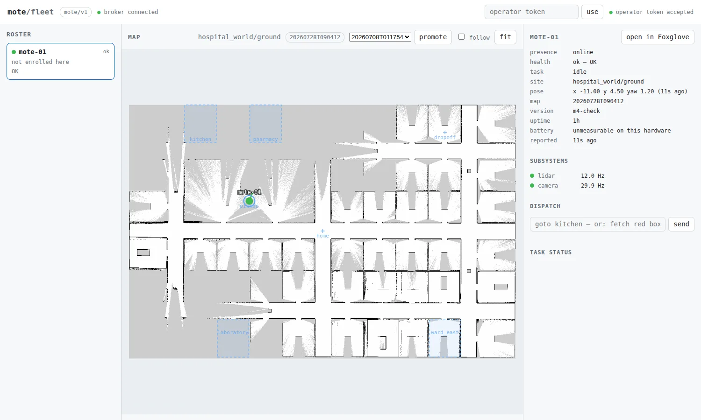

# M4 verification ledger

What was measured for the central site/map registry, how, and what is still
unverified. The interfaces it verifies are [`fleet-api.md`](fleet-api.md) (the
registry routes) and [`control-plane.md`](control-plane.md) (the retained
`…/current` topic and health's new `map` field). The operator flow is
[`README.md` §11](README.md#11-maps-publishing-what-a-robot-mapped-promoting-what-the-fleet-uses).

Everything below was run on the workstation, against a real broker, a real fleet
server and a real browser. **No run on the Pi or across the tailnet** — see §7.

## 1. The acceptance run: publish → candidate → promote → pull

`mote_fleet/test/test_e2e_map_registry.py`, which is the milestone's acceptance
made executable: a real mosquitto, the real fleet API and its registry, the
`publish-map` CLI, `fleetctl promote`, and an agent with a genuine paho client.

The retained half is proved the way it matters — **the pulling robot's agent is
started after the promotion**, with a different `MOTE_HOME`, sharing no ROS graph
and no filesystem with the publisher. The only thing that can tell it about the
map is a retained message handed over on connect.

```console
$ pixi run -e dev python -m pytest mote_fleet/test/test_e2e_map_registry.py -q -s
[INFO] [mote_agent]: agent for mote-02 connecting to mqtt://127.0.0.1:38433
[INFO] [mote_agent]: connected to broker as mote-02
[INFO] [mote_agent]: home/ground: fleet canonical map is 20260728T090412, pulling
enrolled as mote-02 (new)
created site 'home' with floor 'ground' at …/puller/sites/home

pulled 20260728T090412 in 0.10s after the agent connected
127.0.0.1 "GET /v1/sites/home/floors/ground/revisions/20260728T090412/bundle.tar.gz" 200
1 passed in 1.25s
```

(The `publish-map` and `fleetctl promote` output earlier in the run is captured
by the test, which asserts on it, so it is not in the tail above; §4 shows the
same two commands' real output against a live stack.)

**0.10 s from connect to a published local map** on loopback with a small
bundle; the transfer itself is what scales with map size, and the announcement
that triggers it is delivered at connect, not on a poll interval.

Asserted along the way, in order: the upload is a candidate and the floor's
canonical revision is unchanged (`null` here — the floor had no map at all); the
floor's `zones.yaml` travelled *inside* the revision; the promotion flips and
announces; the second robot ends up with a revision that passes validation, a
`resolve_map()` that `nav2_launch.py` would find, the zones from the map's own
frame, and a health payload reporting the revision it is actually running.

## 2. The shared validator, and the parser that is no longer in it

This section originally recorded a hand-rolled YAML parser, differential-tested
against PyYAML on every bundle file committed in the repo, and reported that all
16 agreed. They did. **The corpus was not the contract**, and review found the
gap: nothing committed here has the shape `yaml.safe_dump(default_flow_style=None)`
emits for a polygon, which is what `segment-map` (#69) and `save-zone` actually
write —

```console
$ python -c "…safe_dump({'zones': {'room_1': {'polygon': [[0,0],[4,0],[4,3]]}}}, default_flow_style=None)"
zones:
  room_1:
    polygon:
    - [0.0, 0.0]
    - [4.0, 0.0]
    - [4.0, 3.0]

$ bundle.read_zones(...)
BundleError: line 6: unexpected indentation
```

so the path *segment a floor into rooms → `publish-map`* was a 422. Two more
divergences from the same writer settings: `Matron's office` raised, and — the
bad one — a zone named `Café` came back as `Caf\xE9` **with no error at all**,
because `safe_dump` escapes non-ASCII and the reader stripped quotes without
unescaping.

The fix is not a better parser. The dependency list the parser existed to
protect was already "python **plus paho**", PyYAML is the library that *writes*
these files, and a 200 KB pure wheel is a cheap price for not approximating it.
`bundle.py` now calls `yaml.safe_load`; the fleet image installs `pyyaml` on the
same `pip install` line as paho; 256 lines went with it.

What replaced the corpus test is the writers themselves — `merge_into_zones`
from `segment-map`, `append_zone` from `save-zone`, and `sites.create` — called
for real and read back through the validator:

```console
$ pixi run -e dev python -m pytest mote_bringup/test/test_bundle.py -q
44 passed
```

## 3. Validation and packing cost, on real maps

The occupancy check still decodes the PNG in pure Python (zlib plus five
one-line filters). That one stayed first-party where the YAML parser did not,
and the reasons are different in kind: it reads one rigidly specified binary
format rather than text a dumper wrote, it is 140 lines against Pillow's 4 MB,
and it reports what it cannot read instead of guessing. It is the one place
where "no image library" costs measurable time, so it was measured on the three
committed sim maps, best of three runs:

| Map | Size | Occupancy decode | Full `validate()` | `pack()` | Packed |
|---|---|---|---|---|---|
| `mote_world` | 117×117 (13.7 k px) | 1.6 ms | 1.7 ms | 0.2 ms | 705 B |
| `office_world` | 438×238 (104 k px) | 13.1 ms | 13.3 ms | 0.2 ms | 2.9 kB |
| `hospital_world` | 1158×761 (881 k px) | 137.0 ms | 138.5 ms | 0.9 ms | 46.5 kB |

**~155 ns/pixel**, i.e. 0.14 s for a 58×38 m hospital floor. It runs once per
upload and once per `GET /v1/sites/<site>/floors/<floor>`, never on a request a
robot is waiting on. If a floor an order of magnitude larger ever appears, the
counting loop is the thing to replace (`bytes.translate` + `count` per row),
not the design.

The same run measured the fractions the degeneracy check reads — `mote_world`
0.947 free / 0.043 occupied / 0.010 unknown, `office_world` 0.899 / 0.050 /
0.051, `hospital_world` 0.517 / 0.028 / 0.454 — which is why the "no free space"
floor is set at 0.1%: a legitimate first revision of a big floor is nearly half
unknown, and only a map that never got going has *nothing* free.

**Packing is byte-identical across runs** for all three (fixed member order,
mode, uid/gid and mtime, and a zeroed gzip mtime). That is what lets the
registry announce a digest and then re-pack the stored files to serve it,
instead of keeping the uploaded bytes on disk beside the files unpacked from
them.

**Corrupt is now distinguished from unsupported** (§8): a PNG this reader does
not *support* — 16-bit, palette, interlaced — is a map `map_server` can still
serve, so it costs the occupancy check and a warning; a PNG that is *broken* —
bad filter byte, short IDAT, a stream that does not match its own header — is
what a truncated upload looks like and is an error.

The same run also demonstrates the error/warning split on real data: all three
sim revisions validate `ok=True` with a warning that `map.posegraph`/`map.data`
are missing, because `sim_home/.gitignore` deliberately keeps ~100 MB of
posegraph out of git. Such a revision navigates perfectly and simply cannot be
mapped further — which is a warning to a reader and an error to a publisher.

## 4. The dashboard, in a real browser

A throwaway stack — a container mosquitto on shifted ports (the workstation's
own broker kept 1883/9001), the fleet server with `MOTE_FLEET_HOME` pointed at a
scratch registry seeded from the committed sim bundles, and one robot's retained
presence/health/pose published straight to the wire — driven with a headless
Chromium.



What the picture verifies, none of which a unit test can:

- **Taught zones land on the map.** The four dashed rectangles are
  `hospital_world`'s ward polygons drawn through the Q5 transform, and they sit
  exactly on the room walls in the basemap. `pickup`, `home` and `dropoff` are
  bare waypoints and draw as labelled crosses.
- **The canonical revision is on the page** (the pill beside the floor name),
  with a picker of promotable candidates beside it.
- **Health's new `map` field is rendered** in the detail pane, so a robot that
  has not picked up the canonical revision is visible as a difference rather
  than invisible.

Promotion was then driven **from the browser**, with the operator token pasted
into the page:

```console
$ curl -s .../v1/sites | jq -c '.sites[0] | {canonical, candidates}'
{"canonical":"20260708T000623","candidates":["20260727T101500"]}

$ docker exec mote-m4-broker mosquitto_sub -t 'mote/v1/registry/#' -C 1
{"schema":1,"site":"office_world","floor":"ground","revision":"20260708T000623",
 "url":"/v1/sites/office_world/floors/ground/revisions/20260708T000623/bundle.tar.gz",
 "sha256":"sha256:7748c15c…","bytes":2878,"promoted_by":"michael",
 "stamp":"2026-07-27T22:37:12.454Z"}

$ fleetctl audit --limit 3
WHEN                  WHO            ROBOT      RESULT       COMMAND
2026-07-27T22:37:12Z  michael                   promoted     office_world/ground/20260708T000623
```

The flip, the retained announcement carrying the digest, and the audit row
naming the operator — from a click.

## 5. What the test suite covers

```console
$ pixi run -e dev python -m pytest mote_fleet/test mote_bringup/test/test_bundle.py \
      mote_tasks/test -q
265 passed in 84.40s
$ pixi run -e dev node --test mote_fleet/test/ui_test.mjs
# pass 16
```

The M4 half of that: `test_bundle.py` (43 — what the real writers emit, the
validator's refusals, the PNG decoder's two corruption cases, and the tar's
refusals including a hand-built hostile archive), `test_map_registry.py`
(28 — every registry route over a real socket), `test_mapsync.py` (13 — the
robot's staging, flip, zone adoption and digest check against a live server, no
ROS), seven added to `test_agent.py` (subscribe, route, pull, ignore, report),
five to `test_protocol.py`, three to `ui_test.mjs`, one to `mote_tasks`'
`test_zones.py` (save-zone's output, read back through the validator that has to
accept it), and the e2e run in §1.

## 6. Deltas from the design sketch

Five things landed differently from [`fleet.md` Q4](../design/fleet.md), each for
a reason:

1. **The retained topic is `mote/v1/registry/site/<site>/floor/<floor>/current`,
   not `mote/registry/…`.** The major version belongs in the topic root for the
   same reason it does everywhere else in the tree, and putting `registry` at the
   robot-id level means `registry` must be reserved — which it now is, in
   `protocol.valid_id` and in `parse_topic`.
2. **The shared validator lives in `mote_bringup`, not in `mote_fleet`.** The
   bundle layout is `sites.py`'s, and `mote_fleet` already depends on
   `mote_bringup`; the other direction would be a package cycle. The deploy image
   copies the two ROS-free files (`__init__.py`, `bundle.py`) beside
   `mote_fleet/protocol.py`, so the fleet box still installs no ROS.
3. **Uploads are not operator-authenticated.** The design does not say who may
   upload; making it an operator credential would mean pasting one onto every
   robot. Instead an upload must name an **enrolled robot**, is bounded, is
   audited, and — decisively — is *inert*: it changes no floor. The write that
   changes something is the operator's promote. M7 replaces the `robot_id` check
   with a per-robot credential.
4. **The flip and the announcement are reported separately.** A broker that is
   down must not leave a floor half-promoted, so the symlink flip stands and the
   response says `announced: false`. The fleet server re-announces every floor
   from the filesystem at startup, which repairs both that case and a broker that
   lost its retained state with its volume.
5. **Zones travel inside the revision**, and replace the floor's on install (the
   old file is kept as `zones.<old-rev>.yaml`). The design says map and zones
   must travel together; the consequence nobody writes down is that installing a
   *different* session's map makes the previously taught zones wrong, so leaving
   them in place would be the silent failure the rule exists to prevent.

Also worth recording: `save-map` now runs the same validation locally, so a map
the server would refuse is refused on the robot while the mapping session is
still up.

## 7. Not verified

- **No Pi, no tailnet.** Everything here is loopback on the workstation. The
  transfer size that matters on a real robot is the **posegraph**, which is tens
  of MB and is not in any of these runs (the sim bundles exclude it from git, and
  the e2e test's is a stub). A real `publish-map` over the tailnet is the first
  thing to measure on hardware.
- **Nav2 does not hot-reload a flipped map.** `map_server` reads its map at
  startup, so a pulled revision takes effect on the next bringup. The agent logs
  it and health reports the running revision, which makes the gap visible; making
  the flip take effect live is not in this milestone.
- **No concurrency test on promote.** Two operators promoting different
  revisions of one floor at the same instant is `os.replace` racing itself —
  last writer wins, both are audited, and neither leaves a broken symlink, but
  that is reasoned rather than measured.
- **Pruning is only unit-tested**; no long-running box has actually aged out a
  revision.
- **The `-2` id qualifier is tested, not observed in the wild.** It needs two
  robots saving maps in the same second, which is exactly the case that will not
  show up until M6.

## 8. What review found, and what changed

Five findings on the first pass ([PR #70](https://github.com/ClachDev/Mote/pull/70)),
all reproduced by execution rather than read off the diff. What each one turned
into:

1. **`segment-map`'s output was a bundle this branch refused** (blocking). The
   subject of §2: fixed by deleting the hand-rolled parser rather than
   extending it. The replacement tests call the real writers, because the
   original ones only ever saw files that happened to be committed.
2. **~400 lines re-implementing PyYAML and a PNG reader.** Half taken: PyYAML is
   in, the PNG decoder stays, and §3 says why the two are not the same call.
3. **`validate()` broke its own "never raises" contract** (blocking). `_unfilter`
   raised `BundleError` on an unknown scanline filter, which no caller on the
   upload path caught: the client saw `RemoteDisconnected` with no HTTP status,
   and because the handler died between `registry.record` and `registry.finish`,
   the audit row stayed at `receiving` for ever. Three changes: the decoder
   *reports* every failure and never raises; `bundle_store.accept` treats a
   validator that raises anyway as a 422; and the upload handler closes its
   audit row on any exception, so no row can be wedged mid-transfer by a bug
   that has not been thought of yet. The corrupt/unsupported split in §3 came
   out of this — a bad filter byte now fails the revision instead of merely
   skipping the occupancy check.
4. **Unbounded `zlib.decompress` on the upload path.** IHDR is parsed before the
   inflate, so the bound was free:

   ```console
   $ # a 64 KB PNG whose header declares it 1x1, carrying 64 MB compressed
   bomb PNG on disk: 65295 bytes, declares itself 1x1, inflates to 67108864 bytes
   occupancy() -> {'reason': 'image data is larger than its dimensions allow',
                   'corrupt': True}
   0.2 ms, peak RSS 67 MB (unchanged across the call)
   ```

   Before: 786 MB of RSS for a 261 KB upload, which at the 64 MB `MAX_UPLOAD`
   scaled to ~64 GB. Also from this finding: a map that already failed the
   `MAX_EXTENT_M` sanity check no longer gets decoded pixel-by-pixel afterwards.
5. **The fleet image would not rebuild for its own validator.** `fleet-image.yml`
   triggered on five paths; the Dockerfile COPYs eight. `bundle.py`,
   `bundle_store.py` and `server/ui/**` added, with a comment saying the two
   lists have to agree.

Not changed: the `-2` revision qualifier, the promote race, and pruning are all
still reasoned rather than measured (§7).
