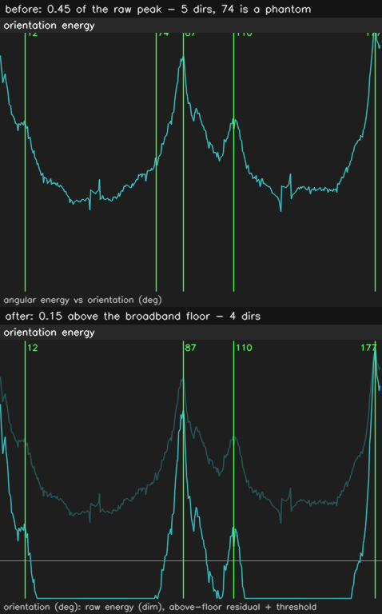

# Orientation picking — the phantom wall direction, 2026-08-11

**Verdict: the declutter pass picks wall orientations by their height above the
angular energy's broadband floor (`peak_rel_threshold` 0.15 of the residual
maximum), not by their height above zero (0.45 of the raw maximum).** The
phantom direction that forced a hand-tuned threshold on the 2026-08-02 flat map
is gone, and the shipped defaults now reproduce that hand-tuned output exactly.
This doc is the measurement behind the change. Data:
`2026-08-11-orientation-picking/`.

## The defect

`_pick_directions` kept any local maximum of the angular energy reaching
`peak_rel_threshold` (0.45) of the global maximum, after suppressing peaks
within 12° of a stronger one.

Clutter, speckle and ragged wall edges put energy at *every* orientation, so a
real map's angular energy is a modest set of wall peaks riding on a broad
pedestal — **measured at 0.49 of the global maximum** on the 2026-08-02 flat
map. A threshold expressed as a fraction of the raw maximum therefore spends
more than half its range below the pedestal, where nothing is a direction and
everything clears the gate.

What survives that gate is whatever the 12° suppression radius happens to
leave: on that map, a direction at **73.8°**, which is the shoulder of the real
86.8° wall family 13.0° away — just outside the radius. It reaches 0.50 of the
raw maximum against the weakest real family's 0.64, a ratio of 1.3, and no
threshold placed between two such numbers is a measurement. The operator's
workaround was `--peak-rel 0.55`, threaded between them by hand.

It is not one map's curiosity. Of the **13 genuine occupancy maps** on this
box, **6 carried such a shoulder**, every one of them 12.0–13.5° from a
stronger peak.

## Two fixes that do not work

**Literal topographic prominence** (a peak's height above the higher of its two
flanking minima) does not separate the phantom from the real families. On the
flat map the phantom's prominence is 0.028 of the maximum and the *real*
off-axis family at 11.8° has 0.033 — because that family sits on the tail of
the dominant one and is a shoulder too, in exactly the same sense. Thresholding
prominence is worse than a wash: it rewards isolation, so it promotes lone
bumps in the noise floor that carry no structural energy at all (47.2° on the
tuning map; 43.2° and 137.2° on the replay maps) while dropping real families.

**A wider suppression radius** cannot separate them either. The phantom is
13.0° from its parent; the real off-axis family is 14.5° from its own. Any
radius that suppresses the one suppresses the other.

## The fix

Subtract the broadband floor before thresholding — the curve smoothed over
`FLOOR_HALFWIDTH_DEG` (45°), i.e. what is left once anything with a wall's
angular sharpness is averaged away. This module already computed that residual
for `angular_stats`; the declutter picker was simply not using it.

On the same two peaks, the residual reads **0.012 for the phantom and 0.296 for
the weakest real family** — 1.3× apart before, 24× apart after.

The threshold moves with the curve: 0.15 of the residual maximum, the same
number `angular_stats` already used on the same kind of curve. **Both halves
have to travel together.** 0.45 on the residual would drop real families; 0.15
on the raw curve returns four directions on a clean synthetic rectilinear map,
two of them flank samples. A test pins that combination.

The threshold's window is measured, and is not wide:

| bound | map | direction | residual |
| --- | --- | --- | --- |
| from below | `sim/mote_world` | 137.2° phantom, admitted at 0.10 | 0.109 |
| from above | `tuning/input_map` | 16.2°, a real family the shipped rule kept | 0.189 |

## What changed, over every map on the box

`corpus.txt` — 13 genuine ROS occupancy PNGs (the tuning input, the three sim
world maps, and eight `map_raw_notraj.png` outputs of the bag-replay harness;
`bag_replay_results/*/*/map.png` is a rendered *figure*, not a map, and is not
in the corpus).

* **7 maps unchanged**, including the whole tuning set and all three sim worlds.
* **6 maps lost exactly one direction each**, and every one of them was a
  shoulder 12.0–13.0° from a stronger peak, with residual 0.012–0.105 against a
  weakest-kept of 0.204–0.285.
* **No map gained a direction.**

## Does it reproduce the hand-tuned map?

Yes, byte for byte. The 2026-08-02 flat map cleaned with the new defaults is
**identical** to the `--peak-rel 0.55` output the operator hand-threaded and
shipped (0 differing cells of 43 259), and differs from the old default's output
by 664 cells. `flat-map-output.txt`.

Room segmentation, which picks directions through the same function to find the
map's dominant rotation, is unchanged on the sim ladder — 30/33 hospital, 10/10
office, 1/1 mote, zero merges, and the same again with the map turned +17° and
−31°.

## What this does not fix

The picker still returns *directions*, not families, and `max_directions` (5) is
still a cap rather than a decision: a building genuinely using six wall
directions loses one, silently. Nothing here estimates how many directions a map
*should* have — `angular_stats`'s frame table is the diagnostic that reads the
answer back, and it is a diagnostic, not a gate.
