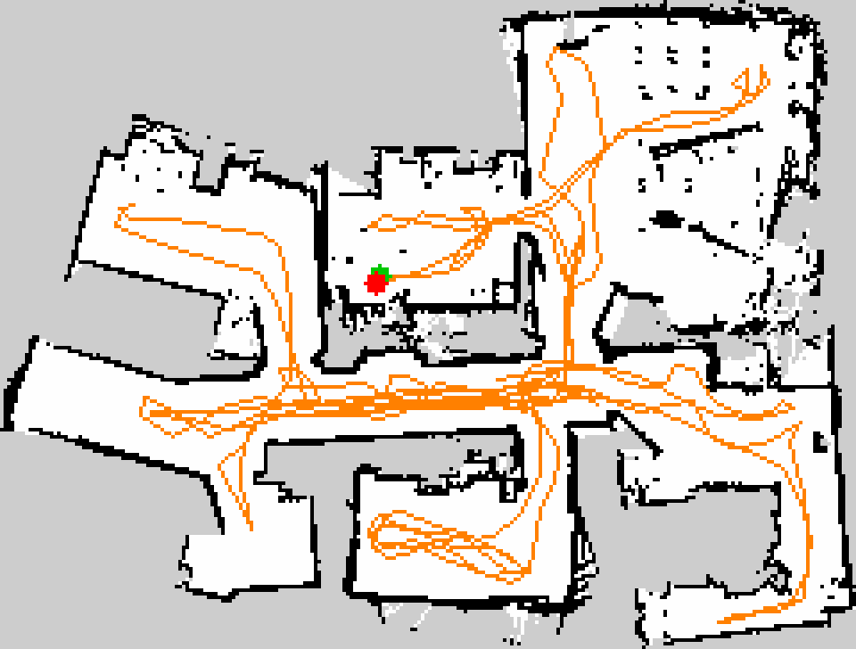
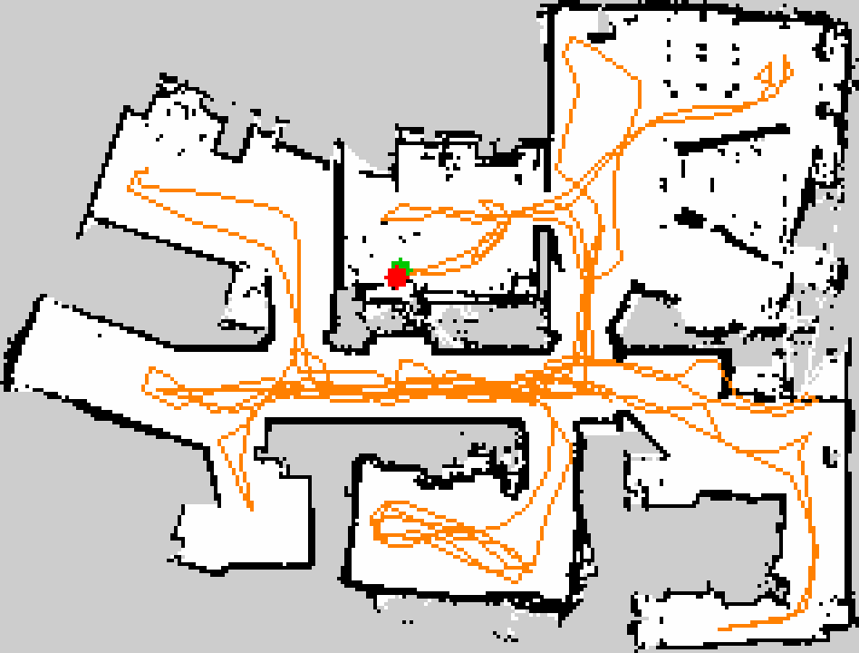

# Bag-replay scoring report

- **generated (UTC):** 20260825T101353Z
- **git commit:** `ae37014`
- **bag:** `/home/michael/Projects/data/mote-bags/20260802_142539`
- **mode:** slam  ·  **feed:** lockstep
- **parameter sets:** 4

## Metrics

Truth-free proxies — see Limitations. Arrows mark the better direction.

| metric | car-0.0349 | car-0.0175 | car-0.01745 | car-0.01745-repeat |
| --- | --- | --- | --- | --- |
| scans replayed | 542 | 542 | 542 | 542 |
| pose-graph nodes | 340 | 340 | 340 | 340 |
| replay wall (s) | 21 | 21 | 21 | 21 |
| traj samples | 340 | 340 | 340 | 340 |
| path length (m) | 139.61 | 139.66 | 139.77 | 139.77 |
| loop drift (m) ↓ | 0.099 | **0.098** | 0.108 | 0.108 |
| drift ratio ↓ | 0.0007 | **0.0007** | 0.0008 | 0.0008 |
| explored area (m²) ↑ | **62.6** | 62.2 | 62.2 | 62.2 |
| unknown frac | 0.427 | 0.417 | 0.417 | 0.417 |
| occupied frac | 0.1040 | 0.1049 | 0.1071 | 0.1071 |
| wall thickness (m) ↓ | **0.064** | 0.065 | 0.065 | 0.065 |
| speckle frac ↓ | **0.0136** | 0.0159 | 0.0195 | 0.0195 |
| angular support (°) | 50.41 | 49.19 | 50.74 | 50.74 |
| wall frames (≥15% energy) | 2 | 2 | 1 | 1 |

## Maps

### car-0.0349

- params: the committed build params with `coarse_angle_resolution: 0.0349`

**Wall directions** (wall orientations, image frame, energy-weighted):

| angle (°) | energy frac | width (°) |
| --- | --- | --- |
| 92.25 | 0.278 | 2.65 |
| 163.75 | 0.112 | 2.18 |
| 2.25 | 0.322 | 2.63 |
| 73.75 | 0.049 | 2.28 |

**Orthogonal frames** (dominant share 0.600):

| frame (°) | energy frac | directions | offset from dominant (°) |
| --- | --- | --- | --- |
| 2.25 | 0.600 | 2 | 0.0 |
| 73.75 | 0.160 | 2 | 18.5 |

### car-0.0175

- params: the committed build params with `coarse_angle_resolution: 0.0175`

**Wall directions** (wall orientations, image frame, energy-weighted):

| angle (°) | energy frac | width (°) |
| --- | --- | --- |
| 92.25 | 0.257 | 2.61 |
| 162.25 | 0.117 | 2.33 |
| 2.25 | 0.309 | 2.65 |
| 79.25 | 0.082 | 3.15 |

**Orthogonal frames** (dominant share 0.566):

| frame (°) | energy frac | directions | offset from dominant (°) |
| --- | --- | --- | --- |
| 2.25 | 0.566 | 2 | 0.0 |
| 72.25 | 0.199 | 2 | 20.0 |

### car-0.01745

- params: the committed build params with `coarse_angle_resolution: 0.01745`

**Wall directions** (wall orientations, image frame, energy-weighted):

| angle (°) | energy frac | width (°) |
| --- | --- | --- |
| 159.75 | 0.098 | 2.26 |
| 179.75 | 0.340 | 2.73 |
| 69.75 | 0.045 | 2.35 |
| 89.75 | 0.278 | 2.64 |

**Orthogonal frames** (dominant share 0.619):

| frame (°) | energy frac | directions | offset from dominant (°) |
| --- | --- | --- | --- |
| 89.75 | 0.619 | 2 | 0.0 |
| 69.75 | 0.143 | 2 | 20.0 |

### car-0.01745-repeat

- params: the committed build params with `coarse_angle_resolution: 0.01745`, rerun to test determinism

**Wall directions** (wall orientations, image frame, energy-weighted):

| angle (°) | energy frac | width (°) |
| --- | --- | --- |
| 159.75 | 0.098 | 2.26 |
| 179.75 | 0.340 | 2.73 |
| 69.75 | 0.045 | 2.35 |
| 89.75 | 0.278 | 2.64 |

**Orthogonal frames** (dominant share 0.619):

| frame (°) | energy frac | directions | offset from dominant (°) |
| --- | --- | --- | --- |
| 89.75 | 0.619 | 2 | 0.0 |
| 69.75 | 0.143 | 2 | 20.0 |

## Limitations

These metrics are **truth-free proxies**, not error measures. A real bag carries no surveyed ground truth, so unlike the sim benchmark (which has Gazebo's true pose and reports ATE), this harness can only score *self-consistency* and *map appearance*:

- **Loop drift** is only meaningful when the robot physically returned to its start — it cannot distinguish a legitimate open A→B traverse from a drifting loop. Know the bag's shape before reading it.
- **Map crispness** (wall thickness, speckle, unknown fraction) catches blur, noise, and incompleteness. It does **not** catch a confidently *wrong* map: a mis-closed loop drawn with sharp walls scores well here.
- **Angular structure** is a **tear detector, not a quality ranking**, and is deliberately not bolded. It answers the one question loop drift cannot: loop drift is only meaningful when the trajectory *closes*, so a session that exits on its exploration budget gets no drift number at all, and for those maps the frame table below is the only automated tear signal there is. Read it like this:

  - **`wall frames` > 1 with real energy share means two rectangular systems in one map** — i.e. a section drawn on its own axes. That is what a SLAM tear looks like. Check the per-map frame table for the offset; run 3's two legs were torn by 25° and 41°.
  - **One extra *direction* is architecture, not damage.** A flat with an angled hallway genuinely has three wall directions. The frame table distinguishes them: a rotated section duplicates a whole frame (`directions: 2`), a hallway adds one (`directions: 1`).
  - **It is blind below ~10°**, the frame merge tolerance, which has to exceed the shear a genuine frame carries (7.5° measured on a real leg) or honest shear would read as a tear. A small rotation will show one frame. Catching that needs a declared direction set for the site, which `angular_stats(..., reference_directions=...)` accepts and this report does not yet supply.
  - **`angular support` is confounded by coverage** and must not be used to rank: a map that explored less has fewer long walls and reads as tighter. On the 2026-07-29 run-3 pair the leg that is better by loop drift (0.551 m vs 8.776 m) scores *worse* on it (42.2 vs 39.3), having covered 59 m² against 81 m². It is here to be read beside `explored area`, not to pick a winner.
- No absolute scale/position check is possible without a reference map or survey. For metric-accuracy claims, use the sim benchmark's ATE.
- Replaying the same recorded sensor stream makes the comparison deterministic in its *input*, but SLAM's solver is not bit-exact run-to-run; treat small deltas as noise.
- **Trajectory rows are only comparable within one feed mode.** A paced leg samples `map→base_link` off TF on a fixed period; a lockstep leg takes the pose graph's own node poses, because `map→odom` is broadcast on a wall-clock timer that a lockstep leg outruns. Path length and drift ratio therefore differ by *sampling*, not by quality — the map rows and `pose-graph nodes` are the ones that cross the two.
