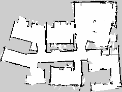
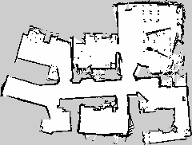
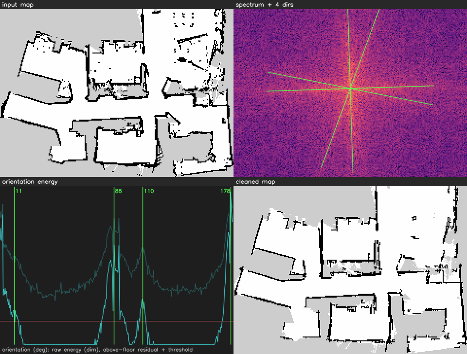
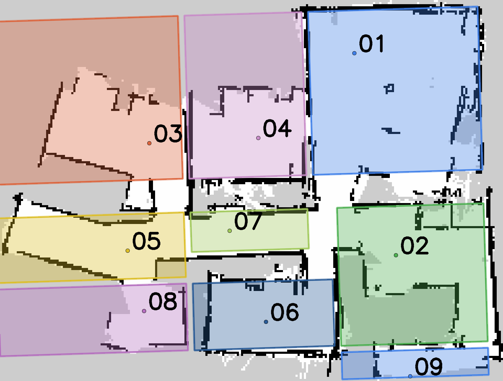

# Map build 20260901T180343

**candidate emitted** — `/home/michael/.claude/jobs/c1592bca/tmp/acceptance3/20260901T170343Z/revision/20260901T180343` — validated, packed as `20260901T180343.tar.gz`

## Inputs

| input | value |
|---|---|
| bag | /home/michael/.mote/bags/mapping/20260802_142539 |
| bag sha256 | 099f9d0608ec818c75a3c5792c13b7e5a4d58a9c5fcd8f005a43a40088750f40 |
| bag bytes | 191910513 |
| slam params | /home/michael/Projects/mote/.claude/worktrees/map-build-orchestrator/mote_bringup/config/slam_toolbox_build_params.yaml |
| params sha256 | 072929cf88c0147758b2a471546c7fac9a236b1ffef8d14c25981d54a3b4bb37 |
| frame injection (x, y, yaw°) | [0.0, 0.0, -3.0] |
| feed | lockstep |
| harness commit | 1c75eac |
| built (UTC) | 20260901T170343Z |

## Stages

| stage | outcome | detail |
|---|---|---|
| solve | ok | 340 pose-graph nodes from 542 scans in 21 s |
| assemble | ok | 240x182 @ 0.050 m/px, origin (-5.316, -5.211, 0.000) |
| declutter | ok | -1244 cells, +277, wall directions [11.2, 88.2, 110.2, 178.2] |
| segment | ok | 9 room zone(s) proposed |
| carry forward | stub | task 345 — names are reported, not rebound |
| validate | ok | valid |
| score | ok | 1 metric(s) worse than the baseline: map.speckle_frac |
| package | ok | 20260901T180343.tar.gz, 7101101 bytes, sha256:a1d6a4393b634f43… |

## Validation

`bundle.validate` — **valid**

- no errors, no warnings

## Metrics

Baseline: `/home/michael/.claude/jobs/c1592bca/tmp/baseline/20260802T203339`

These are **truth-free proxies**: the bag carries no ground truth, so a confidently wrong map can score well. Read them beside the map.

The `map.*` rows are the map this revision **serves** — after the declutter pass — on both sides, because that is what a promotion publishes. The raw solve's are in `build.json` under `map_raw`.

| metric | candidate | baseline | delta | vs baseline | reading |
|---|---|---|---|---|---|
| loop.start_end_dist_m | 0.09919 | — | — | — | lower is better — start↔end distance, if the run closed |
| loop.drift_ratio | 0.0007105 | — | — | — | lower is better — that distance over path length |
| map.mean_wall_thickness_m | 0.06015 | 0.0607 | -0.0005498 | same | lower is better — wall crispness; blur reads thicker |
| map.speckle_frac | 0.003637 | 0.002768 | 0.0008691 | worse | lower is better — isolated occupied cells |
| map.explored_area_m2 | 63.26 | 62.83 | 0.435 | same | higher is better — decided cells × cell area |

A change under 2% reads as `same`: the solver is not bit-identical run to run. **Nothing here blocks** — a regression is evidence for the reviewer, not a gate.

## Wall structure

| frame | angle (deg) | directions | energy share | off dominant |
|---|---|---|---|---|
| 0 | 2.25 | 2 | 0.5785 | 0 |
| 1 | 73.75 | 2 | 0.219 | 18.5 |

`angular_support_deg` 50.7, 4 wall direction(s), dominant frame share 0.5785. Support is **not** a quality ranking — a map that explored less has fewer long walls and reads as tighter.

A rectilinear building puts every wall in one frame. A second frame carrying real energy with **two** directions in it means a section of the map is drawn on its own axes — a tear. A second frame with one direction is an angled hallway, which is architecture.

The build does **not** align the map frame. Measuring a map's wall rotation well enough to gate a re-solve on it is task 615 (`docs/tuning/2026-09-01-alignment-residual.md`): the estimator in the tree called four maps square that were 3.5–5.6° out. Until it lands, birth-alignment is an operator's judgment, passed as `--frame X Y YAW`, and recorded above.

## Zones

Segmentation proposed 9 room(s): `room_01`, `room_02`, `room_03`, `room_04`, `room_05`, `room_06`, `room_07`, `room_08`, `room_09`

**Not carried forward**: the baseline floor names 7 place(s) — `room_01`, `room_02`, `room_03`, `room_04`, `room_05`, `room_06`, `room_07`. Re-binding them onto this map's rooms is task 345; until it lands the reviewer renames the placeholders above in the dashboard's zone editor, which is where a name is edited on a candidate anyway.

## Renders

### Built map (served)

### Raw solve

### Declutter diagnostics

### Proposed rooms

## Next

Review the map above, then upload `20260901T180343.tar.gz` to the registry as a candidate for `home/ground`. The upload route accepts enrolled robots only, so a builder needs a credential of its own — that is task 344; until it lands, a robot at the site can side-load the revision directory into its floor and `pixi run publish-map --revision 20260901T180343`. Promotion is unchanged: an operator's audited call, in the dashboard or `fleetctl promote`.
