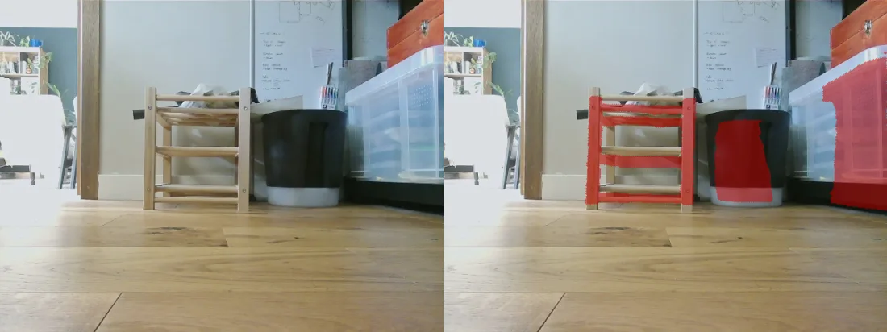
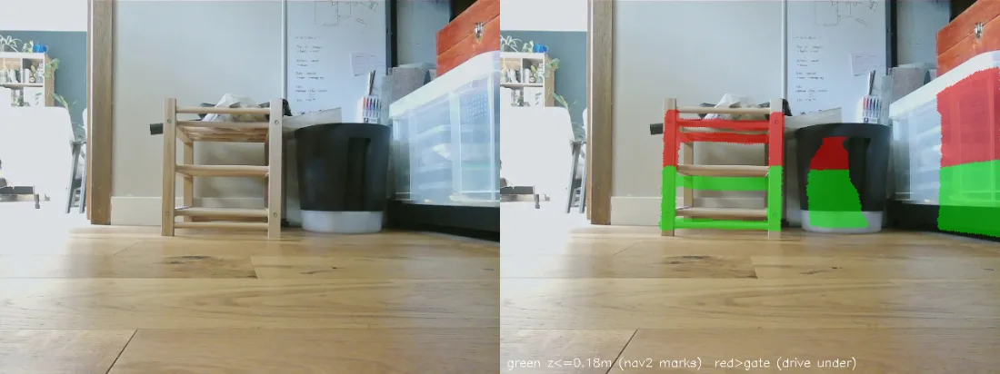

# mote_perception

Home for Mote's camera-derived perception nodes. This is **L0 (Foundation)** of
the vision pipeline: package scaffold, a camera health monitor, camera-calibration
plumbing, and confirmation of compressed image transport. Obstacle detection and
ML (L1) come later. This package **runs on the robot** (it will eventually feed
Nav2), so unlike `mote_simulation` it is synced to the Pi.

## Nodes

- `camera_monitor` — subscribes to `image` (remapped to `/image_raw`) and logs
  the measured frame rate, resolution, and encoding every few seconds, warning
  when no frames arrive. Dependency-light (rclpy + sensor_msgs, no OpenCV).

Run the launch:

```bash
pixi run perception
```

## Camera calibration

A committed default calibration (`config/camera_info.default.yaml`) ships as a
fallback, and a per-robot `~/.mote/camera_calibration.yaml` overrides it when
present. Most robots need no calibration of their own — see
[`config/README.md`](config/README.md) for when it's worth doing and the
`camera_calibration cameracalibrator` procedure.

## Compressed transport

`ros-jazzy-image-transport-plugins` is already a project dependency, so the
camera node publishes `/image_raw/compressed` automatically alongside the raw
stream. Off-board consumers (RViz on a workstation, remote viewers) should prefer
the `compressed` transport — raw 640x480 @ 30 FPS is roughly 28 Mbps, which
saturates Wi-Fi.

Note: a `ros2 topic pub` of a fake `sensor_msgs/msg/Image` will **not** produce a
`/image_raw/compressed` topic. Only a real `image_transport` publisher (the
camera) or an `image_transport republish` node emits the compressed variant.

## L1 — Obstacle perception (off-board monocular depth)

Turns the single RGB camera into a `PointCloud2` of obstacles (`/camera_obstacles`)
for a Nav2 voxel/obstacle layer — catching the low/thin things the 2D lidar plane
misses (cables, thresholds, table & chair legs, a robot vacuum). The lidar stays
the primary, low-latency obstacle and clearing source; this is a slower
supplementary **marker**.

### Live output

On the robot, facing a cluttered floor:



*Detection (right) vs. raw camera (left): the stool legs, bin, and a **transparent** box mark — while the open floor produces no false positives.*



*Go-under gate: green (≤ 0.18 m) marks so Nav2 avoids the legs; red is above the robot's height and passable — it paths through the gap beneath a seat or tabletop.*

Pipeline: **Depth Anything V2-Small (relative)** gives a dense disparity map,
inverted to depth. Its scale is arbitrary, so every frame is **metrically rescaled
by an affine-in-disparity fit (Theil-Sen) anchored to lidar range returns**
(`lidar_rescale.py`) — the lidar gives metric truth through a chassis-fixed
transform that's invariant to body/floor tilt. When a scan can't constrain the
fit (facing a flat wall, no depth spread) the last good correction is held; before
the first fit the frame is skipped. (An earlier floor-plane scale anchor was
removed: it shifted with floor slope and resting pitch.) The floor plane is then
fit per frame and the cloud rotated level (`ground_projection.py`) to remove
residual camera tilt, so a point's z is its true height above the floor. Points
above `z_obstacle` (default 0.02 m) become the cloud, stamped at **image-capture
time** so Nav2 places it via tf at the moment it was seen (this is how the off-board
latency is absorbed).

Depth inference is too heavy for the Pi CPU (~0.5 s/frame), so it runs **off-board**
as two processes:

- `tools/depth_server.py` — keeps the model resident and serves depth over a
  socket. Runs in a dedicated pixi environment (kept out of the ROS/robot env on
  purpose):
- `depth_obstacle_node` — light rclpy node (no torch); forwards each compressed
  frame to the server, rescales, and publishes the cloud. Runs anywhere (robot or
  workstation):
- Workstation all-in-one command: starts the depth server and the ROS obstacle
  node together, using the workstation's ROS graph:
  ```bash
  pixi run depth
  ```

The wire protocol between them (length-prefixed TCP frames) is defined in one
place, `mote_perception/depth_wire.py` — the spec, the framing helpers, the
`DepthClient` used by the node and the offline tools, and the reasons a
hand-rolled protocol beats gRPC/ROS for this link are all in its docstring.

Key params: `z_obstacle` (height deadband, default 0.02 m — below ~1.5 cm floor
noise false-positives), `range_min`/`range_max` (default 0.25–1.2 m: the mount's
usable floor band, past which monocular depth compresses into false positives),
`server_host`/`server_port`.

### Nav2 costmap layer

`camera_obstacles` feeds a dedicated `VoxelLayer` (`camera_layer`) on the **local**
costmap only (`mote_bringup/config/nav2_params.yaml`) — near-band and reactive, so
it can stop the robot at a low obstacle without the phantom risk a slow, laggy
source would add to the global plan. It is a separate layer from the lidar
`obstacle_layer`: the lidar stays the primary marking/clearing source and the
camera can never clear a lidar mark. The camera layer marks and clears from its
own dense observations (a spurious mark is raytraced away on the next frame), and
`sensor_frame: camera_optical_link` pins the clearing-ray origin to the real camera
height (the cloud itself carries leveled `base_footprint` coordinates) so rays
descend onto the floor rather than sweeping up through the low-obstacle band.

**Go-under clearance.** The obstacle band has an upper bound so the robot isn't
blocked by things it fits beneath. The camera layer's `max_obstacle_height` is the
robot's height plus a margin: **0.18 m for the current ~0.13 m chassis (no arm)**.
A chair seat or tabletop above that is passable overhead and does not mark;
because it is a 3D voxel layer, the *legs* (which reach the floor) still mark, so
the robot avoids the legs and paths through the clear gap between them. **With the
planned arm the robot is ~0.30 m** — raise the gate to ~0.35 m *and* the voxel-grid
top (`z_voxels * z_resolution`); note the go-under benefit largely disappears at
that height. The node mirrors the gate with a generous `z_obstacle_max` publish
ceiling (0.5 m — Nav2 is the authoritative gate) so it doesn't stream points Nav2
discards; the node's `z_ceiling` bounds only the full debug cloud.

Decay caveat: a phantom mark over open floor with nothing above-floor behind it
within `obstacle_max_range` receives no clearing ray until the 3 m rolling window
scrolls past it as the robot moves. Near-band false positives measured ≈ 0 on
clean floor (including bright/specular sun-glare floor, the case that defeated the
classical spike), so this is rare; if it shows up on the robot, swap in
`spatio_temporal_voxel_layer` (time-decay + frustum clearing).

Live bring-up (the remaining gate — all validation so far is offline against
recorded bags): run `pixi run depth` on the workstation **alongside** `pixi run
robot`/`nav` on the Pi — the two share one DDS graph, and nothing launches the
depth node in-mission by design (it is off-board). Then check, in order:
1. `/camera_obstacles` is publishing (~2 Hz) and the `camera_layer` actually marks
   in the local costmap. If it doesn't, the off-board ~0.6 s latency is the first
   suspect — raise the local costmap `transform_tolerance` (the cloud is stamped at
   capture, so tf must still hold that stamp).
2. Drive slowly past a low obstacle (cable / threshold / the clothes-horse
   cross-bar) and confirm it marks and the controller avoids it.
3. Watch for motion-only false positives: `_ground_correct` holds the last good
   level rotation when a frame's floor fit fails, and a stale rotation applied at a
   new pose can tilt the floor above the 0.02 m gate. Static-frame evals can't
   surface this; if it appears, tighten `plane_max_tilt_deg` or the fit gates.

### Offline tools

Everything is developed and validated offline against recorded bags
(`pixi run record`). All run in the dev/default env; the three depth tools need a
server up (`pixi run depth-server`). Shared bag loading lives in
`tools/bag_utils.py`; each tool's docstring has the details.

- `depth_bag_replay.py` — re-runs the exact pipeline on a bag; prints per-frame
  fit diagnostics (the rig that found the RANSAC bistability).
- `depth_bag_eval.py` — model accuracy/speed vs lidar, plus side/BEV inspection
  views; model-agnostic, for comparing depth servers.
- `depth_obstacles.py` — decision-level overlay (what marks and why) and the
  camera-vs-lidar BEV, both point sets transformed into `base_footprint`.
- `bag_overlay.py` — geometry sanity check: floor grid + lidar projected into
  the camera frames.
- `measure_camera_pitch.py` — live checkerboard measurement of camera
  pitch/roll/height (mount calibration).
